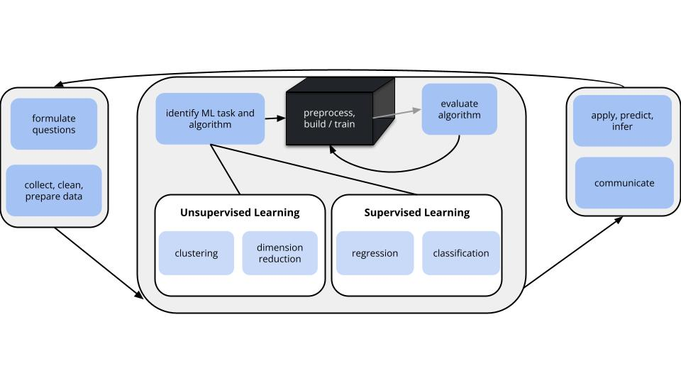

```{r include = FALSE}
knitr::opts_chunk$set(
  collapse = TRUE, 
  warning = FALSE,
  message = FALSE,
  fig.height = 2.75, 
  fig.width = 4.25,
  fig.env='figure',
  fig.pos = 'h',
  fig.align = 'center')
```


You can download the .qmd file for this activity [here](../activity_templates/L11-logistic-regression.qmd) and open in R-studio. The rendered version is posted in the [course website](https://mutasim221b.github.io/Mac-STAT-253-Sp-26/) (Activities tab). I often experiment with the class activities (and see it in live!) and make updates, but I always post the final version before class starts. To be sure you have the most up-to-date copy, please download it once you’ve settled in before class begins.


# Learning Goals {-}

- Use a logistic regression model to make hard (class) and soft (probability) predictions
- Interpret non-intercept coefficients from logistic regression models in the data context

<br>


# Notes: Logistic Regression {-}

## Where are we? {.unnumbered .smaller}

{width=100%}

**CONTEXT**

- **world = supervised learning**       
    We want to model some output variable $y$ using a set of potential predictors ($x_1, x_2, ..., x_p$).

- **task = CLASSIFICATION**       
    $y$ is categorical and **binary**

- **(parametric) algorithm**        
    logistic regression

\

**GOAL**

Use the *parametric* logistic regression model to model and classify $y$.    

<br>


## Logistic Regression Review {.unnumbered .smaller}

Let $y$ be a binary categorical response variable:    
$$y = 
\begin{cases}
1 & \; \text{ if event happens} \\
0 & \; \text{ if event doesn't happen} \\
\end{cases}$$    

Further define
$$\begin{split}
p &= \Pr(y = 1) = \text{ probability event happens} \\
1-p &= \Pr(y = 0) = \text{ probability event doesn't happen} \\
\text{odds} & = \text{ odds event happens} = \frac{p}{1-p} \\
\end{split}$$    

Then a logistic regression model of $y$ by predictors $x_1, \dots, x_p$ is
$$\begin{split}
\log(\text{odds}) & = \beta_0 + \beta_1 x_1 + \dots + \beta_p x_p \\ 
\text{odds} & = e^{\beta_0 + \beta_1 x_1 + \dots + \beta_p x_p} \\
p           & = \frac{\text{odds}}{\text{odds}+1} = \frac{e^{\beta_0 + \beta_1 x_1 + \dots + \beta_p x_p}}{e^{\beta_0 + \beta_1 x_1 + \dots + \beta_p x_p}+1} \\
\end{split}$$


**Coefficient interpretation**:    

- $\beta_0$: LOG(ODDS) of event when $x_1=0, \dots, x_p = 0$
- $\beta_1$: (additive) change in LOG(ODDS) of event associated with a 1 unit increase in $x_1$, holding $x_2, \dots, x_p$ constant
- etc.

(PREFERRED) **_Exponentiated_ coefficient interpretation**: 

- $e^{\beta_0}$: ODDS of event when $x_1=0, \dots, x_p = 0$
- $e^{\beta_1}$: multiplicative change in ODDS of event associated with a 1 unit increase in $x_1$, holding $x_2, \dots, x_p$ constant
- etc.

<br>


# Team Discussion {-}

Let us work through the following examples as a class. 


\

## Example 1: Check out the data {.unnumbered .smaller}

```{r example-1}
#| eval: true
#| code-fold: true
# Load packages
library(tidyverse)
library(tidymodels)

# Load weather data from rattle package
library(rattle)
data("weatherAUS")

# Wrangle data
sydney <- weatherAUS %>% 
  filter(Location == "Sydney") %>% 
  select(RainTomorrow, Humidity9am, Sunshine)

# Check it out
head(sydney)
```


Let's model `RainTomorrow`, whether or not it rains tomorrow in Sydney, by *two* predictors: 

- `Humidity9am` (% humidity at 9am today)
- `Sunshine` (number of hours of bright sunshine today)

Check out & comment on the relationship of rain with these 2 predictors:

```{r example-1b}
#| eval: true
#| code-fold: true
# Store so we can modify later
rain_plot <- sydney %>%
  ggplot(aes(y = Humidity9am, x = Sunshine, color = RainTomorrow)) + 
  geom_point(alpha = 0.5)
rain_plot
```


> Rainy days tend to be preceded by high humidity and low sunshine.

<br>

## Example 2: Interpreting coefficients {.unnumbered .smaller}

The logistic regression model is:

- log(odds of rain) = -1.01 + 0.0260 Humidity9am - 0.313 Sunshine
- odds of rain = exp(-1.01 + 0.0260 Humidity9am - 0.313 Sunshine)
- probability of rain = odds / (odds + 1)

Let's interpret the Sunshine coefficient of -0.313:

```{r example-2, eval=TRUE}
# Not transformed
-0.313

# Transformed
exp(-0.313)
```


a. *When controlling for humidity*, and for every extra hour of sunshine, the LOG(ODDS) of rain...
    - decrease by 0.313
    - are roughly 31% as big (i.e. decrease by 69%)
    - are roughly 73% as big (i.e. decrease by 27%)
    - increase by 0.731
    
b. *When controlling for humidity*, and for every extra hour of sunshine, the ODDS of rain...
    - decrease by 0.313
    - are roughly 31% as big (i.e. decrease by 69%)
    - are roughly 73% as big (i.e. decrease by 27%)
    - increase by 0.731


> a. decrease by 0.313
> b. are roughly 73% as big (i.e. decrease by 27%)


<br>

## Definition: odds ratio {.unnumbered .smaller}

The (slope) coefficients on the odds scale are *odds ratios (OR)*:

$$e^{\beta_1} = \frac{\text{odds of event at x + 1}}{\text{odds of event at x}}$$


<br>

## Example 3: Classifications {.unnumbered .smaller}

log(odds of rain) = -1.01 + 0.0260 Humidity9am - 0.313 Sunshine

Suppose there's 99% humidity at 9am today and only 2 hours of bright sunshine.

a. What's the probability of rain?

```{r example-3, eval = TRUE}
# log(odds of rain)
log_odds <- -1.01 + 0.0260 * 99 - 0.313 * 2
log_odds

# odds of rain (MODIFY THIS)
exp(-1.01 + 0.0260 * 99 - 0.313 * 2)

# probability of rain
2.554867 / (1 + 2.554867)
```


b. What's your binary *classification*: do you predict that it will rain or not rain?


> rain


<br>

## Example 4: Classification rules (intuition) {.unnumbered .smaller}

We used a simple classification rule above with a probability threshold of c = 0.5:

- If the probability of rain >= c, then predict rain.
- Otherwise, predict no rain.

Let's translate this into a classification rule that **partitions** the data points into rain / no rain predictions based on the predictor values.

What do you think this classification rule / partition will look like? 
In other words: on the plot below, where would you place a line such that one one side of the line you predict rain and on the other side of the line you predict no rain?

```{r example-4}
#| eval: true
#| code-fold: true
# Include the line Humidity9am = 38.84615 + 12.03846 Sunshine
rain_plot +
  geom_abline(intercept = 38.84615, slope = 12.03846, size = 2) 

```


<br>

## Example 5: Building the classification rule {.unnumbered .smaller}

- If ..., then predict rain.
- Otherwise, predict no rain.


Identify the *pairs* of humidity and sunshine values for which the probability of rain is 0.5, hence the log(odds of rain) is 0.

:::{.callout-tip title="Pause and Reflect"}
Convince yourself of this statement is true: if the probability of rain is 0.5, then the log(odds of rain) is 0.
:::


<br>

## Example 6: Examine the classification rule {.unnumbered .smaller}

Let's visualize the **partition**, hence **classification regions** defined by our classification rule:

```{r example-6}
#| eval: true
#| code-fold: true
# Example data points
example <- data.frame(Humidity9am = c(90, 90, 60), 
                      Sunshine = c(2, 5, 10), 
                      RainTomorrow = c(NA, NA, NA))

# Include the line Humidity9am = 38.84615 + 12.03846 Sunshine
rain_plot +
  geom_abline(intercept = 38.84615, slope = 12.03846, size = 2) + 
  geom_point(data = example, color = "darkblue", size = 3)
```

Use our classification rule to predict rain / no rain for the following days:

- Day 1: humidity = 90, sunshine = 2
- Day 2: humidity = 90, sunshine = 5
- Day 3: humidity = 60, sunshine = 10


<br>

## Example 7: General properties {.unnumbered .smaller}

a. Does the logistic regression algorithm have a tuning parameter?


b. Estimating the logistic regression model requires the same pre-processing steps as least squares regression.       
    - Is it necessary to standardize quantitative predictors? If so, does the R function do this for us?
    - Is it necessary to create dummy variables for our categorical predictors? If so, does the R function do this for us?


\


# Settling In {.unnumbered}

- Make sure that you are synchronized as a group.
- Work as many exercises as you can together as a group (not alone!) and finish the rest after the class.
- Raise your hand or call out to me if you have any question!


\


<br>
<br>

# Exercises  {-}   

Work on exercises 1--8 [optional 9--10] with your group.

Pay attention to new terms and concepts!

**Goals**    

- Implement logistic regression in R.    
- *Evaluate* the accuracy of our logistic regression classifications.


<br>

## Part 1: Build the model  {.unnumbered .smaller}

Let's continue with our analysis of `RainTomorrow` vs `Humidity9am` and `Sunshine`. You're given all code here. Be sure to scan and _reflect upon what's happening_.


\

**STEP 0: Organize the y categories**

We want to model the log(odds of *rain*), thus the `Yes` category of `RainTomorrow`.

But R can't read minds.

We have to explicitly tell it to treat the `No` category as the *reference level* (not the category we want to model).

```{r exercises-step0, eval=TRUE}
sydney <- sydney %>%
  mutate(RainTomorrow = relevel(RainTomorrow, ref = "No"))
```


\

**STEP 1: logistic regression model specification**

What's new here?

```{r exercises-step1, eval=TRUE}
logistic_spec <- logistic_reg() %>%
  set_mode("classification") %>% 
  set_engine("glm")
```


\

**STEP 2: variable recipe**

There are no *required* pre-processing steps, but you could add some. Nothing new here!

```{r exercises-step2, eval=TRUE}
variable_recipe <- recipe(RainTomorrow ~ Humidity9am + Sunshine, data = sydney)
```


\

**STEP 3: workflow specification (recipe + model)**

Nothing new here!

```{r exercises-step3, eval=TRUE}
logistic_workflow <- workflow() %>% 
  add_recipe(variable_recipe) %>%
  add_model(logistic_spec) 
```


\

**STEP 4: Estimate the model using the data**

Since the logistic regression model has no tuning parameter to tune, we can just `fit()` the model using our sample data -- no need for `tune_grid()`!

```{r exercises-step4, eval=TRUE}
logistic_model <- logistic_workflow %>% 
  fit(data = sydney)
```


\

**Check out the tidy model summary**

Note that these coefficients are the same that we used in the above examples.

```{r exercises-step5, eval=TRUE}
logistic_model %>% 
  tidy()

# Transform coefficients and confidence intervals to the odds scale
# These are odds ratios (OR)
logistic_model %>% 
  tidy() %>%
  mutate(
    OR = exp(estimate),
    OR.conf.low = exp(estimate - 1.96*std.error),
    OR.conf.high = exp(estimate + 1.96*std.error)
  )
```


<br>
<br>

## Part 2: Apply & evaluate the model {.unnumbered .smaller}


1. **Predictions & classifications**    
    Consider the weather on 4 days in our data set:    
    
```{r examples, eval=TRUE}
examples <- sydney[7:10,]
examples
```
    
Use the `logistic_model` to calculate the probability of rain *and* the rain prediction / classification for these 4 days.
    
```{r exercise1}
logistic_model %>% 
  augment(new_data = examples)
```

a. Convince yourself that you understand what's being reported in the `.pred_class`, `.pred_No`, and `.pred_Yes` columns, as well as the correspondence between these columns (how they're related to each other). (**Suggestion: try reproducing the calculations for at least one row of the example data by hand.**)


b. How many of the 4 classifications were accurate?


<br>
    
**Confusion matrix**    

Let's calculate the `in_sample_classifications` for *all* days in our `sydney` sample ("in-sample" because we're evaluating our model using the same data we used to build it):
    
```{r classify, eval = TRUE}
in_sample_classifications <- logistic_model %>% 
  augment(new_data = sydney)
    
# Check it out
head(in_sample_classifications)
```


\

A **confusion matrix** summarizes the accuracy of the `.pred_class` model classifications. You'll answer follow-up questions in the next exercises.        
    
```{r confusion, eval = TRUE}
in_sample_confusion <- in_sample_classifications %>% 
  conf_mat(truth = RainTomorrow, estimate = .pred_class)
```
    
```{r eval = TRUE}
# Check it out in table form
in_sample_confusion
```
    
    

\

We can also represent our confusion matrix visually: 
    
```{r}
#| eval: true
#| fig-height: 2.5
#| fig-width: 3
# Check it out in plot form
in_sample_confusion %>% 
  autoplot()
```
    
```{r}
#| eval: true
#| fig-height: 2.5
#| fig-width: 3
# Check it out in a color plot (which we'll store and use later)
mosaic_plot <- in_sample_confusion %>% 
  autoplot() +
  aes(fill = rep(colnames(in_sample_confusion$table), ncol(in_sample_confusion$table))) + 
  theme(legend.position = "none")
    
mosaic_plot
```


<br>

2. **Overall accuracy**    
```{r eval=TRUE}
in_sample_confusion
```

a. What do these numbers add up to, both numerically and contextually?        

```{r}
        
```

b. Use this matrix to calculate the *overall* accuracy of the model classifications. That is, what proportion of the classifications were correct?   

```{r}
        
```

c. Check that your answer to part b matches the `accuracy` listed in the confusion matrix `summary()`:  

```{r eval=TRUE}
# event_level indicates that the second RainTomorrow
# category (Yes) is our category of interest
summary(in_sample_confusion, event_level = "second")
```


<br>

3. **No information rate**    
    Are our model classifications any better than just randomly guessing rain / no rain?! What if we didn't even build a model, and just always predicted the most common outcome of `RainTomorrow`: that it *wouldn't* rain?!       
    
```{r eval=TRUE}
sydney %>% 
  count(RainTomorrow)
```
    
a. Ignoring the `NA` outcomes, prove that if we just always predicted no rain, we'd be correct 74.2% of the time. This is called the **no information rate**.        

```{r}
        
```
    
b. Is the overall accuracy of our logistic regression model (81.2%) meaningfully better than this random guessing approach?
    
    
    

\

4. **Sensitivity**    
Beyond *overall* accuracy, we care about the accuracy within each class (rain and no rain). Our model's **true positive rate** or **sensitivity** is the probability that it correctly classifies rain as rain. This is represented by the fraction of rain observations that are red:        

```{r}
#| eval: true
#| code-fold: true
# NOTE: We're only plotting RAINY days
in_sample_classifications %>% 
  filter(RainTomorrow == "Yes") %>% 
  mutate(correct = (RainTomorrow == .pred_class)) %>% 
  ggplot(aes(y = Humidity9am, x = Sunshine, color = correct)) + 
  geom_point(alpha = 0.5) + 
  geom_abline(intercept = 38.84615, slope = 12.03846, size = 2) + 
  scale_color_manual(values = c("black", "red"))
```
    
Or, the proportion of the `Yes` column that falls into the `Yes` prediction box:

```{r}
#| eval: true
#| echo: false
mosaic_plot
```
    
    
a. Visually, does it appear that the sensitivity is low, moderate, or high?
    
b. Calculate the sensitivity using the confusion matrix.        

```{r eval=TRUE}
in_sample_confusion
```   

c. Check that your answer to part b matches the `sens` listed in the confusion matrix `summary()`:       
eval=TRUE
```{r eval=TRUE}
summary(in_sample_confusion, event_level = "second")
```

d. Interpret the sensitivity and comment on whether this is low, moderate, or high.
    
    


<br>

5. **Specificity**    
    Similarly, we can calculate the model's **true negative rate** or **specificity**, i.e. the probability that it correctly classifies "no rain" as "no rain". This is represented by the fraction of no rain observations that are red: 
    
```{r eval=TRUE}
# NOTE: We're only plotting NON-RAINY days
in_sample_classifications %>% 
  filter(RainTomorrow == "No") %>% 
  mutate(correct = (RainTomorrow == .pred_class)) %>% 
  ggplot(aes(y = Humidity9am, x = Sunshine, color = correct)) + 
  geom_point(alpha = 0.5) + 
  geom_abline(intercept = 38.84615, slope = 12.03846, size = 2) + 
  scale_color_manual(values = c("black", "red"))
```
    
Or, the proportion of the `No` column that falls into the `No` prediction box:
    
```{r eval=TRUE, echo = FALSE}
mosaic_plot
```
    
a. Visually, does it appear that the specificity is low, moderate, or high?
    
b. Calculate specificity using the confusion matrix.

```{r eval=TRUE}
in_sample_confusion
```       

c. Check that your answer to part b matches the `spec` listed in the confusion matrix `summary()`:       

```{r eval=TRUE}
summary(in_sample_confusion, event_level = "second")
```

d. Interpret the specificity and comment on whether this is low, moderate, or high.
    


<br>

6. **In-sample vs CV Accuracy**    
The above **in-sample** metrics of overall accuracy (0.812), sensitivity (0.526), and specificity (0.912) helped us understand how well our model classifies rain / no rain for the same data points we used to build the model. Let's calculate the **cross-validated** metrics to better understand how well our model might classify days in the future:

```{r eval=TRUE}
# NOTE: This is very similar to the code for CV with least squares!
# EXCEPT: We need the "control" argument to again specify our interest in the "Yes" category
set.seed(253)
logistic_model_cv <- logistic_spec %>% 
  fit_resamples(
    RainTomorrow ~ Humidity9am + Sunshine,
    resamples = vfold_cv(sydney, v = 10), 
    control = control_resamples(save_pred = TRUE, event_level = 'second'),
    metrics = metric_set(accuracy, sensitivity, specificity)
  )

# Check out the resulting CV metrics
logistic_model_cv %>% 
  collect_metrics()
```
    
How similar are the in-sample and CV evaluation metrics? Based on these, do you think our model is overfit?
    


<br>

7. **Specificity vs Sensitivity**    
    a. Our model does better at correctly predicting non-rainy days than rainy days (specificity > sensitivity). *Why* do you think this is the case?
    b. In the context of predicting rain, what would *you* prefer: high sensitivity or high specificity?       
    c. Changing up the probability threshold we use in classifying days as rain / no rain gives us some control over sensitivity and specificity. Consider *lowering* the threshold from 0.5 to 0.05. Thus if there's even a 5% chance of rain, we'll predict rain! What's your intuition:        
        - sensitivity will decrease and specificity will increase
        - sensitivity will increase and specificity will decrease
        - both sensitivity and specificity will increase
    


<br>

8. **Change up the threshold**        
Let's try lowering the threshold to 0.05!

```{r eval=TRUE}
# Calculate .pred_class using a 0.05 threshold
# (this overwrites the default .pred_class which uses 0.5)
new_classifications <- logistic_model %>% 
  augment(new_data = sydney) %>% 
  mutate(.pred_class = ifelse(.pred_Yes >= 0.05, "Yes", "No")) %>% 
  mutate(.pred_class = as.factor(.pred_class))
```

```{r eval=TRUE}
# Obtain a new confusion matrix
new_confusion <- new_classifications %>% 
  conf_mat(truth = RainTomorrow, estimate = .pred_class)
new_confusion
```

```{r eval=TRUE}
# Obtain new summaries    
summary(new_confusion, event_level = "second")
```
        
a. How does the new sensitivity compare to that using the 0.5 threshold (0.526)?
    
b. How does the new specificity compare to that using the 0.5 threshold (0.912)?
    
c. Was your intuition right? When we decrease the probability threshold...  
    - sensitivity decreases and specificity increases
    - sensitivity increases and specificity decreases
    - both sensitivity and specificity increase
        
d. WE get to pick an appropriate threshold for our analysis. Change up 0.05 in the code below to identify a threshold *you* like.  

```{r}
# Calculate .pred_class using a 0.05 threshold
# (this overwrites the defaulty .pred_class which uses 0.5)
new_classifications <- logistic_model %>% 
  augment(new_data = sydney) %>% 
  mutate(.pred_class = ifelse(.pred_Yes >= 0.05, "Yes", "No")) %>% 
  mutate(.pred_class = as.factor(.pred_class))

# Obtain a new confusion matrix
new_confusion <- new_classifications %>% 
  conf_mat(truth = RainTomorrow, estimate = .pred_class)
new_confusion

# Obtain new summaries    
summary(new_confusion, event_level = "second")
```


<br>

9. **OPTIONAL challenge**         
    In Example 5, we built the following classification rule based on a 0.5 probability threshold:
    
- If `Humidity9am > 38.84615 + 12.03846 Sunshine`, then predict rain.
- Otherwise, predict no rain.
    
And we plotted this rule:
    
```{r eval=TRUE}
ggplot(sydney, aes(y = Humidity9am, x = Sunshine, color = RainTomorrow)) + 
  geom_point(alpha = 0.5) + 
  geom_abline(intercept = 38.84615, slope = 12.03846, size = 2) + 
  geom_point(data = example, color = "black", size = 3)
```
    
  Challenge: Modify this rule and the plot using a 0.05 probability threshold.
    


<br>

10. **OPTIONAL math**    
    For a general logistic regression model
    
$$log(\text{odds}) = \beta_0 + \beta_1 x$$
    
$\beta_1$ is the change in log(odds) when we increase $x$ by 1:
    
$$\beta_1 = log(\text{odds at x + 1}) - log(\text{odds at x})$$
    
Prove $e^{\beta_1}$ is the *multiplicative* change in odds when we increase $x$ by 1.    
    


<br>
<br>

# Future Reference: R code Notes {.unnumbered .smaller}

Suppose we want to build a model of categorical response variable `y` using predictors `x1` and `x2` in our `sample_data`.


```{r eval = FALSE}
# Load packages
library(tidymodels)

# Resolves package conflicts by preferring tidymodels functions
tidymodels_prefer()
```


**Organize the y categories**

Unless told otherwise, our R functions will model the log(odds) of whatever `y` category is *last* alphabetically.
To be safe, we should always set the reference level of `y` to the outcome we are NOT interested in (eg: "No" if modeling `RainTomorrow`).

```{r eval = FALSE}
sample_data <- sample_data %>%
  mutate(y = relevel(y, ref = "CATEGORY NOT INTERESTED IN"))
```


**Build the model**

```{r eval = FALSE}
# STEP 1: logistic regression model specification
logistic_spec <- logistic_reg() %>%
  set_mode("classification") %>% 
  set_engine("glm")
```

```{r eval = FALSE}
# STEP 2: variable recipe
# There are no REQUIRED pre-processing steps, but you CAN add some
variable_recipe <- recipe(y ~ x1 + x2, data = sample_data)
```

```{r eval = FALSE}
# STEP 3: workflow specification (recipe + model)
logistic_workflow <- workflow() %>% 
  add_recipe(variable_recipe) %>%
  add_model(logistic_spec) 
```

```{r eval = FALSE}
# STEP 4: Estimate the model using the data
logistic_model <- logistic_workflow %>% 
  fit(data = sample_data)
```


**Examining model coefficients**

```{r eval = FALSE}
# Get a summary table
logistic_model %>% 
  tidy()

# Transform coefficients and confidence intervals to the odds scale
# These are odds ratios (OR)
logistic_model %>% 
  tidy() %>%
  mutate(
    OR = exp(estimate),
    OR.conf.low = exp(estimate - 1.96*std.error),
    OR.conf.high = exp(estimate + 1.96*std.error)
  )
```


**Calculate predictions and classifications**

```{r eval = FALSE}
# augment gives both probability calculations and classifications
# Plug in a data.frame object with observations on each predictor in the model
logistic_model %>% 
  augment(new_data = ___)

  
# We can also use predict!
# Make soft (probability) predictions
logistic_model %>% 
  predict(new_data = ___, type = "prob")

# Make hard (class) predictions (using a default 0.5 probability threshold)
logistic_model %>% 
  predict(new_data = ___, type = "class")
```


**In-sample evaluation metrics**

```{r eval = FALSE}
# Calculate in-sample classifications
in_sample_classifications <- logistic_model %>% 
  augment(new_data = sample_data)

# Confusion matrix
in_sample_confusion <- in_sample_classifications %>% 
  conf_mat(truth = y, estimate = .pred_class)

# Summaries
# event_level = "second" indicates that the second category
# is the category of interest
summary(in_sample_confusion, event_level = "second")

# Mosaic plots
in_sample_confusion %>% 
  autoplot()

# Mosaic plot with color
in_sample_confusion %>% 
  autoplot() +
  aes(fill = rep(colnames(in_sample_confusion$table), ncol(in_sample_confusion$table))) + 
  theme(legend.position = "none")
```


**Cross-validated evaluation metrics**

```{r eval = FALSE}
set.seed(___)
logistic_model_cv <- logistic_spec %>% 
  fit_resamples(
    y ~ x1 + x2,
    resamples = vfold_cv(sample_data, v = ___), 
    control = control_resamples(save_pred = TRUE, event_level = 'second'),
    metrics = metric_set(accuracy, sensitivity, specificity)
  )

# Check out the resulting CV metrics
logistic_model_cv %>% 
  collect_metrics()
```


<br>
<br>

# Deeper learning (OPTIONAL) {.unnumbered .smaller}

Recall that in least squares regression, we use *residuals* to both estimate model coefficients (those that minimize the residual sum of squares) and measure model strength ($R^2$ is calculated from the variance of the residuals).
BUT the concept of a "residual" is different in logistic regression.
Mainly, we *observe* binary y outcomes but our predictions are on the probability scale.
In this case, logistic regression requires different strategies for estimating and evaluating models. 

- **Calculating coefficient estimates**       
   A common strategy is to use iterative processes to identify coefficient estimates $\hat{\beta}$ that *maximize the likelihood function* $$L(\hat{\beta}) = \prod_{i=1}^{n} p_i^{y_i}(1-p_i)^{1-y_i} \;\; \text{ where } \;\; log\left(\frac{p_i}{1-p_i}\right) = \hat{\beta}_0 + \hat{\beta}_1 x$$

- **Measuring model quality**       
   *Akaike's Information Criterion (AIC)* is a common metric with which to *compare models*. The smaller the AIC the better! Specifically: $$\text{AIC} = \text{-(likelihood of our model)} + 2(p + 1)$$ where $p$ is the number of non-intercept coefficients.  


<br>
<br>


\
\


# Solutions {.unnumbered .smaller}

## Small Group Discussion {-}

Example 1: Check out the data 


<details>
<summary>Solution:</summary>

```{r eval=TRUE}
rain_plot
```

Rainy days tend to be preceded by high humidity and low sunshine.
</details>
<br>


Example 2: Interpreting coefficients


<details>
<summary>Solution:</summary>
a. decrease by 0.313
b. are roughly 73% as big (i.e. decrease by 27%)
</details>
<br>


Example 3: Classifications

<details>
<summary>Solution:</summary>
a. .

```{r eval=TRUE}
# log(odds of rain)
-1.01 + 0.0260 * 99 - 0.313 * 2

# odds of rain (MODIFY THIS)
exp(-1.01 + 0.0260 * 99 - 0.313 * 2)

# probability of rain
2.554867 / (1 + 2.554867)
```

b. rain
</details>
<br>


Example 4: Classification rules (intuition) 


<details>
<summary>Solution:</summary>
answer will vary (just looking for your intuition here!)

here's where the partition line ends up being: 

```{r}
#| eval: true
# Include the line Humidity9am = 38.84615 + 12.03846 Sunshine
rain_plot +
  geom_abline(intercept = 38.84615, slope = 12.03846, size = 2) 
```


we'll derive this in the next question
</details>
<br>


Example 5: Building the classification rule 

<details>
<summary>Solution:</summary>
1. Set the log odds to 0:        
    `log(odds of rain) = -1.01 + 0.0260 Humidity9am - 0.313 Sunshine = 0`
    
2. Solve for Humidity9am:        
    - Move constant and Sunshine term to other side.        
        `0.0260 Humidity9am = 1.01 + 0.3130 Sunshine`
    - Divide both sides by 0.026:       
        `Humidity9am = (1.01 / 0.026) + (0.3130 / 0.026) Sunshine = 38.846 + 12.038 Sunshine`
        
This gives us the equation for the partition line. 
On one side of the line, we'll predict rain; on the other side, no rain.

_Which side is which?_
We'll predict rain as long as the probability of rain is greater than 0.5. 
But if the probability of rain is greater than 0.5, this means the odds of rain are greater than 1, and in turn the log odds of rain are greater than 0. 
Thus, predict rain if the log odds of rain are greater than 0. 
The equality above becomes an inequality: 

1. Check if the log odds are greater than 0: 
    `-1.01 + 0.0260 Humidity9am - 0.313 Sunshine > 0`

2. Solve for Humidity9am: 
    `Humidity9am > 38.846 + 12.038 Sunshine`

</details>
<br>


Example 6: Examine the classification rule 

<details>
<summary>Solution:</summary>

- Day 1: rain (90 > 38.846 + 12.038 * 2 = `r 38.846 + 12.038 * 2`)
- Day 2: no rain (90 < 38.846 + 12.038 * 5 = `r 38.846 + 12.038 * 5`)
- Day 3: no rain (60 < 38.846 + 12.038 * 10 = `r 38.846 + 12.038 * 10`)

</details>
<br>


Example 7: General properties

<details>
<summary>Solution:</summary>
a. no
b. .    
    - no, R doesn’t standardize for logistic.
    - yes and yes, R does this for us.
</details>
<br>


## Exercises {-}

### Part 1: Build the model

No solutions for this part. Review the code above, reflect on what's happening, and pose any questions during class time!

<br>


### Part 2: Apply & evaluate the model

1. **Predictions & classifications**    

<details>
<summary>Solution:</summary>
a. `.pred_class` (classification based on probability 0.5 threshold), `.pred_No` (probability of no rain), and `.pred_Yes` (probability of rain)
b. 3
</details>
<br>


2. **Overall accuracy**    

        
<details>
<summary>Solution:</summary>
a. sample size (not including data points with NA on variables used in our model)       

```{r eval=TRUE}
3119 + 563 + 301 + 625
```

b. 

```{r eval=TRUE}
(3119 + 625) / (3119 + 563 + 301 + 625)
```

c. yep   
</details>
<br>


3. **No information rate**    

<details>
<summary>Solution:</summary>
 a. We're only right when it doesn't rain.
 
```{r eval=TRUE}
 3443 / (3443 + 1196)
```
    
b. this is subjective -- depends on context / how we'll use the predictions / consequences for being wrong.
    
</details>
<br>


4. **Sensitivity**
    
<details>
<summary>Solution:</summary>
a. moderate (or low)
b. .

```{r eval=TRUE}
625 / (625 + 563)
```       

c. yep       
d. We correctly anticipate rain 52.6% of the time. Or, on 52.6% of rainy days, we correctly predict rain.
</details>
<br>


5. **Specificity**    

<details>
<summary>Solution:</summary>
a. high
b. .        
```{r eval=TRUE}
3119 / (3119 + 301)
```       

c. yep       

```{r eval=TRUE}
summary(in_sample_confusion, event_level = "second")
```

d. On 91.2% of non-rainy days, we correctly predict no rain.
    
</details>
<br>


6. **In-sample vs CV Accuracy**    


<details>
<summary>Solution:</summary>
They're similar, thus our model doesn't seem overfit.
</details>
<br>


7. **Specificity vs Sensitivity**    

<details>
<summary>Solution:</summary>

a. because non-rainy days are much more common
b. will vary. would you rather risk getting wet instead of carrying your umbrella, or carry your umbrella when it doesn't rain?
c. will vary
    
</details>
<br>


8. **Change up the threshold**        

<details>
<summary>Solution:</summary>
a. much higher (0.981)
b. much lower (0.182)
c. sensitivity increases and specificity decreases
d. will vary
</details>
<br>


9. **OPTIONAL challenge**         
 
<details>
<summary>Solution:</summary>

- If `Humidity9am > -74.385 + 12.03846 Sunshine`, then predict rain.
- Otherwise, predict no rain.
    
```{r eval=TRUE}
ggplot(sydney, aes(y = Humidity9am, x = Sunshine, color = RainTomorrow)) + 
  geom_point(alpha = 0.5) + 
  geom_abline(intercept = -74.385, slope = 12.03846, size = 2) + 
  geom_point(data = example, color = "black", size = 3)
```
    
**Work**
    
```{r eval=TRUE}
prob <- 0.05
odds <- prob / (1 - prob)
log(odds)
```
    
Set log(odds) to -2.944:
    
log(odds of rain) = -1.01 + 0.0260 Humidity9am - 0.313 Sunshine = -2.944
    
0.0260 Humidity9am = -2.944 + 1.01 + 0.3130 Sunshine = -1.934 + 0.3130 Sunshine
    
Humidity9am = (-1.934/0.0260) + (0.3130/0.0260) Sunshine = -74.385 + 12.038 Sunshine
    

</details>
<br>


10. **OPTIONAL math**    

<details>
<summary>Solution:</summary>
$$\begin{split}
    \beta_1 & = log(\text{odds at x + 1}) - log(\text{odds at x}) \\
    & = log\left(\frac{\text{odds at x + 1}}{\text{odds at x}} \right) \\
    e^{\beta_1} & = e^{log\left(\frac{\text{odds at x + 1}}{\text{odds at x}} \right)}\\
    & = \frac{\text{odds at x + 1}}{\text{odds at x}} \\
    \end{split}$$
</details>
<br>

