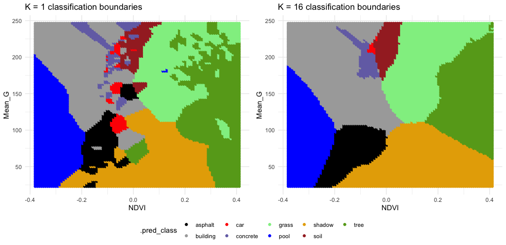
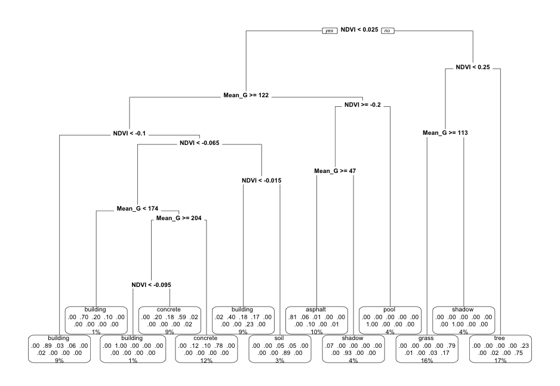
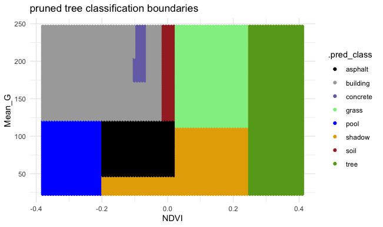
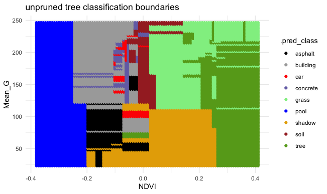
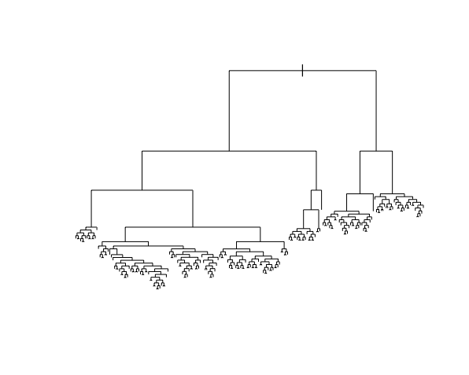

```{r include = FALSE}
knitr::opts_chunk$set(
  collapse = TRUE, 
  warning = FALSE,
  message = FALSE,
  fig.height = 2.75, 
  fig.width = 4.25,
  fig.env='figure',
  fig.pos = 'h',
  fig.align = 'center')
```


You can download the .qmd file for this activity [here](../activity_templates/L14-knn-trees-2.qmd) and open in R-studio. The rendered version is posted in the [course website](https://mutasim221b.github.io/Mac-STAT-253-Sp-26/) (Activities tab). I often experiment with the class activities (and see it in live!) and make updates, but I always post the final version before class starts. To be sure you have the most up-to-date copy, please download it once you’ve settled in before class begins.


# Learning Goals {-}

- Clearly describe the recursive binary splitting algorithm for tree building for both regression and classification
- Compute the weighted average Gini index to measure the quality of a classification tree split
- Compute the sum of squared residuals to measure the quality of a regression tree split
- Explain how recursive binary splitting is a greedy algorithm
- Explain how different tree parameters relate to the bias-variance tradeoff

\
\


# Notes: Nonparametric Classification {-}

## Where Are We? {.unnumbered .smaller}

{width=90%}

**CONTEXT**

- **world = supervised learning**       
    We want to model some output variable $y$ using a set of potential predictors ($x_1, x_2, ..., x_p$).

- **task = CLASSIFICATION**       
    $y$ is categorical

- **algorithm = NONparametric**        
    
 
 
**GOAL**

Build and evaluate **nonparametric** classification models of some **categorical** outcome y.

\


## Quick Recap {.unnumbered .smaller}

How do we evaluate classification models? 

. . . 

Binary Metrics: 

- Accuracy (overall; compare to no information rate = frequency of largest class)
- Sensitivity (accuracy among Y = 1, true positive rate, recall)
- Specificity (accuracy among Y = 0, true negative rate)
- False Positive Rate = 1 - Specificity
- ROC AUC (accounts for many thresholds)
  - the probability that a randomly chosen case from the Y=1 class will receive, from the classifier, a higher predicted probability than a randomly chosen case from the Y = 0 class

. . .

More Binary Metrics [optional]:

- False Negative Rate = 1 - Sensitivity
- J Index =  Sensitivity + Specificity - 1
- Balanced Accuracy = (Sens + Spec)/2
- Kappa (how much better your model is over using class frequencies)
- MCC (correlation between truth and prediction)
- Positive Predictive Value (accuracy among those we predicted Y = 1, precision)
- Precision-Recall AUC (accounts for many thresholds)
- F measure = $(1 + \beta^2) * precision*recall/((\beta^2*precision) +recall)$ (chosen beta gives one or the other more weight)


\


## Motivating Example {.unnumbered .smaller}

We'll continue to classify land type using metrics from aerial photographs:

{width=100%}

```{r}
#| eval: true
#| echo: false
# Load packages
library(tidyverse)
library(tidymodels)
library(kknn)        # for KNN
library(rpart.plot)  # for plotting trees
library(class)       # for my plotting functions
```

```{r}
#| eval: true
#| code-fold: true
# Load & process data
# NOTE: Our y variable has to be converted to a "factor" variable, not a character string
land <- read.csv("https://kegrinde.github.io/stat253_coursenotes/data/land_cover.csv") %>% 
  rename(type = class) %>% 
  mutate(type = as.factor(type))
```

```{r}
#| eval: true
# There are 9 land types! 
# Let's consider all of them (not just asphalt, grass, trees)
land %>% 
  count(type)
```

```{r}
#| eval: true
# There are 675 data points and 147 potential predictors of land type!
dim(land)
```

```{r}
#| eval: true
# For now: we'll consider Mean_G & NDVI
# (It's not easy to visually distinguish between 9 colors!)

# Plot type vs Mean_G alone
ggplot(land, aes(x = Mean_G, fill = type)) + 
  geom_density(alpha = 0.5) + 
  scale_fill_manual(values = c("#000000", "darkgray", "red", "#7570B3", "lightgreen", "blue", "#E6AB02", "brown", "#66A61E")) + 
  theme_minimal()
```

```{r}
#| eval: true
# Plot type vs NDVI alone
ggplot(land, aes(x = NDVI, fill = type)) + 
  geom_density(alpha = 0.5) + 
  scale_fill_manual(values = c("#000000", "darkgray", "red", "#7570B3", "lightgreen", "blue", "#E6AB02", "brown", "#66A61E")) + 
  theme_minimal()
```

```{r}
#| eval: true
# Finally consider both
ggplot(land, aes(y = Mean_G, x = NDVI, color = type)) + 
  geom_point() + 
  scale_color_manual(values = c("#000000", "darkgray", "red", "#7570B3", "lightgreen", "blue", "#E6AB02", "brown", "#66A61E")) + 
  theme_minimal()
```


\
\


# Small Group Discussion {-}

Discuss the following examples with your group.


## Example 1: KNN {.unnumbered .smaller}

Check out the classification regions for two KNN models of land `type` by `Mean_G` and `NDVI`: using K = 1 neighbor and using K = 16 neighbors.

Though the KNN models were *built* using standardized predictors, the predictors are plotted on their original scales here.

{width=100%}


Discuss:

- What do KNN regression and classification have in common?
- How are they different?


\

## Example 2: Pruned tree {.unnumbered .smaller}

Next, consider a **PRUNED classification tree** of land `type` by `Mean_G` and `NDVI` that was pruned as follows:

- set maximum depth to 30
- set minimum number of data points per node to 2
- tune the **cost complexity parameter**.


{width=100%}


{width=100%}


Discuss:

- What's missing from the leaf nodes?
- Why did this happen?
- What are the three tuning parameters for classification trees? How does each of these impact our tree?
- Do you think we need to normalize our predictors before building a tree? Why or why not?


\

## Example 3: Unpruned tree {.unnumbered .smaller}

Finally, consider a (mostly) **UNPRUNED classification tree** of land `type` by `Mean_G` and `NDVI` that was built using the following tuning parameters:

- set maximum depth to 30
- set minimum number of data points per node to 2
- set cost complexity parameter to 0.


Check out the classification regions defined by this tree:

{width=100%}


And the tree itself.

This tree was plotted using a function that draws the length of each branch split to be proportional to its improvement to the classification accuracy.
The labels are left off to just focus on structure:

{width=100%}


Discuss:

- What happens to the length of the split branches the further down the tree we get? What does this mean?
- What are your thoughts about this tree? Overfit or underfit?


\

## Example 4: No information rate {.unnumbered .smaller}

- Review: What is the "no information rate" and why is it a useful point of comparison for classification models? 
- For what choice of $K$ would KNN yield predictions that are equivalent to the no information rate? 
- For what choice of tuning parameters would a classification tree yield predictions that are equivalent to the no information rate? 


\
\

# Notes: New Concepts {-}

## Gini Index  {.unnumbered .smaller}

**Gini Index**: Node Purity Measure

$$G = p_1(1-p_1) + p_2(1-p_2) + \cdots + p_k(1-p_k)$$

- "probability of misclassifying a randomly selected case"
-  Smaller signals "better" classifier
-  Used to decide whether or not to split based on the cost-complexity parameter (default in rpart)

*Need a refresher on these details? Review slides 28--31 from the pre-class videos:* [link](https://drive.google.com/file/d/1gJ6JdtPJwXz4bACpsz0hEQrc8H2wdt5R/view?usp=sharing).

## Information Index {.unnumbered .smaller}

**Information/Entropy Index**: Alternative to Gini 

$$I = -(p_1\log(p_1) + p_2\log(p_2) + \cdots + p_k\log(p_k))$$

- "measure of amount of uncertainty in the data"
-  Smaller signals "better" classifier
-  Used to decide whether or to split based on the cost-complexity parameter (option in rpart)


\
\

# Exercises {-}

## Part 1  {.unnumbered .smaller}

Let's focus on trees.

We've explored some general ML themes already:

- model building: parametric vs nonparametric       
    benefits and drawbacks of using nonparametric trees vs parametric algorithm logistic regression
    
- algorithm details:
    - steps of the tree algorithm
    - **tuning** a tree algorithm

In the exercises, you'll explore some other important themes:

- model building: variable selection        
    We have *147* potential predictors of land type. How can we choose which ones to use?
    
- model evaluation & comparison       
    How good are our trees? Which one should we pick?
    
- regression vs classification        
    KNN works in both settings. So do trees!


\

### Exercise 1: Build 10 trees{-}
    
In modeling land `type` by **all 147** possible predictors, our goal will be to build a tree that optimize the `cost_complexity` parameter. The chunk below builds 10 trees, each using a different `cost_complexity` value while fixing our other tuning parameters to be very liberal / not restrictive:        

- `tree_depth` = 30 (the default)
    - Mini-investigation: How does `tree_depth = NULL` make `tree_depth = 30`?
        - Enter `?decision_tree` in the Console to pull up the help page. Note what is displayed in the **Usage** section.
        - Click the `rpart` link in the **Description** section.
- `min_n` in each leaf node = 2 (the default is 20)
    
Reflect on the code and pause to answer any questions (Q). 
    
```{r eval=TRUE}
# STEP 1: tree specification
# Q: WHAT IS NEW HERE?!
tree_spec <- decision_tree() %>%
  set_mode("classification") %>% 
  set_engine(engine = "rpart") %>% 
  set_args(cost_complexity = tune(),  
           min_n = 2, 
           tree_depth = NULL)
```
    
```{r eval=TRUE}
# STEP 2: variable recipe
# NOTHING IS NEW HERE & THERE ARE NO PREPROCESSING STEPS!
variable_recipe_big <- recipe(type ~ ., data = land)
    
# STEP 3: tree workflow
# NOTHING IS NEW HERE!
tree_workflow_big <- workflow() %>% 
  add_recipe(variable_recipe_big) %>% 
  add_model(tree_spec)
```
    
    
```{r eval=TRUE}
# STEP 4: Estimate 10 trees using a range of possible cost complexity values
# cost_complexity is on the log10 scale (10^(-5) to 10^(0.1))
# Q: BY WHAT CV METRIC ARE WE COMPARING THE TREES?
# Q: WHY NOT USE CV MAE?
set.seed(253)
tree_models_big <- tree_workflow_big %>% 
  tune_grid(
    grid = grid_regular(cost_complexity(range = c(-5, 0.1)), levels = 10),
    resamples = vfold_cv(land, v = 10),
    metrics = metric_set(accuracy)
  )
```


\

### Exercise 2: Whew! {-}

We only built 10 trees above, and it took quite a bit of time. Why are trees computationally expensive?


\

### Exercise 3: Compare and finalize the tree {-}

Just as with our other algorithms with tuning parameters, we can use the CV metrics to compare the 10 trees, and pick which one we prefer.

Here, we'll pick the *parsimonious tree* (which also happens to be the tree with the largest CV accuracy!).

Run & reflect upon the code below, then answer some follow-up questions.
    
```{r eval=TRUE}
# Compare the CV metrics for the 10 trees
tree_models_big %>% 
  autoplot() + 
  scale_x_continuous()
    
# Pick the parsimonious parameter
parsimonious_param_big <- tree_models_big %>% 
  select_by_one_std_err(metric = "accuracy", desc(cost_complexity))
parsimonious_param_big
    
# Finalize the tree with parsimonious cost complexity
big_tree <- tree_workflow_big %>% 
  finalize_workflow(parameters = parsimonious_param_big) %>% 
  fit(data = land)
```
    
a. What is happening as the cost-complexity parameter $\alpha$ increases:        
    - the tree is getting more *complicated* and the accuracy is *improving*
    - the tree is getting more *complicated* and the accuracy is getting *worse*
    - the tree is getting *simpler* and the accuracy is *improving*
    - the tree is getting *simpler* and the accuracy is getting *worse*

b. What will our tree look like if we use a cost complexity parameter bigger than 0.4? As what category will this tree predict all images to be?

c. CHALLENGE: For cost complexity parameters bigger than 0.4, the accuracy plateaus at roughly 18.1%. Where does this number come from?! NOTE: If you get stumped here, move on. We'll come back to this later.

d. You don't have to write anything out (this is largely review), but convince yourself that you could:       
    - interpret the plot
    - i.d. where our parsimonious tree falls on this plot
    - explain what "parsimonious" means
    


\

### Exercise 4: Examine the tree {-}

Let's examine the final, tuned `big_tree` which models land `type` by all 147 predictors:   

```{r eval=TRUE, fig.width = 9, fig.height = 6}
# This tree has a bunch of info
# BUT: (1) it's tough to read; and (2) all branch lengths are the same (not proportional to their improvement)
big_tree %>% 
  extract_fit_engine() %>% 
  rpart.plot()
    
# We can make it a little easier by playing around with
# font size (cex) and removing some node details (type = 0)
big_tree %>% 
  extract_fit_engine() %>% 
  rpart.plot(cex = 0.8, type = 0)
```
    
```{r eval=TRUE, fig.width = 9, fig.height = 6}
# This tree (1) is easier to read; and (2) plots branch lengths proportional to their improvement
# But it has less info about classification accuracy
big_tree %>% 
  extract_fit_engine() %>%
  plot()
big_tree %>% 
  extract_fit_engine() %>%
  text(cex = 0.8)
```
    
Use the *second* tree plot to answer the following questions.
    
a. Are any land types *not* captured somewhere in the tree: asphalt, building, car, concrete, grass, pool, shadow, soil, tree? If so, why do you think this is?

b. This tree considered all 147 possible predictors. Do all of these appear in the final tree?

c. Of the predictors used in the tree, which seem to be the most important?


\

### Exercise 5: Identifying useful predictors {-}

Luckily, we don't have to *guesstimate* the importance of different predictors.

There's a mathematical metric: **variable importance**.

Roughly, a predictor's importance measures the total improvement in node purity if we were to split on this predictor (even if the predictor isn't ultimately used in a split).

The bigger the better!

Check out the importance of our 147 predictors.
    
```{r eval=TRUE}
# Check out just the 10 most important (for simplicity)
big_tree %>%
  extract_fit_engine() %>%
  pluck("variable.importance") %>% 
  head(10)
```
    
And plot these to help with comparison:
    
```{r eval=TRUE, fig.width = 8, fig.height = 8}
# By default, this plots only 10 predictors
# At most, it will plot only half of our predictors here
# (I'm not sure what the max is in general!)
library(vip)
big_tree %>% 
  vip(geom = "point", num_features = 147)
```
    
a. What are the 3 most important predictors by this metric? Do these appear in our tree?

b. *Why* do you think a predictor can have high importance but not appear in the tree? Name 2 reasons.

c. If you could pick only 3 predictors to model land type, would you pick the 3 with the highest importance? Explain.

d. (Come back to this if you have time) Compare the above description of variable importance to the description in Section 3.4 of the `rpart` [vignette](https://cran.r-project.org/web/packages/rpart/vignettes/longintro.pdf). (A vignette for an R package is like a detailed user manual.)
    - What additional details are presented in the vignette?
    - What terminology is unfamiliar? Try to find information on this terminology elsewhere in the vignette.
    - After understanding this terminology, go back to the variable importance description in Section 3.4 and see if it makes more sense.
 
 
 
 
 
 
 
 
    
\

### Exercise 6: How good is the tree?!? Part 1 {-}

Stepping back, our goal for building this tree was to classify land type for a pixel in an image.

As an example, suppose we have a pixel in an image like the first one in our data set:
    
```{r eval=TRUE}
head(land, 1)
```
    
Our tree correctly predicts that this is a car:
    
```{r eval=TRUE}
big_tree %>% 
  predict(new_data = head(land, 1))
```
    
But how good are the classifications overall?

Let's first consider the CV *overall accuracy rate*:   

```{r eval=TRUE}
# reminder of our chosen tuning parameter
parsimonious_param_big

# pull out metrics for just that value of tuning parameter
tree_models_big %>%
  collect_metrics() %>%
  filter(cost_complexity == parsimonious_param_big$cost_complexity)
```
    
a. *Interpret* 0.804, the CV overall accuracy rate for the `big_tree`.

b. Calculate & compare the tree's CV overall accuracy rate to the **no information rate**: is the `big_tree` better than just always guessing the most common land type? You'll need the following info:       

```{r eval=TRUE}
land %>% 
  nrow()
          
land %>% 
  count(type)
```

c. Why can't we calculate, thus compare, the sensitivity & specificity of our tree? HINT: Think of how these are defined.


\

### Exercise 7: How good is the tree?!? Part 2 {-}

The above CV metric gives us a sense of the *overall* quality of using our tree to classify a *new* pixel in an image.

But it doesn't give any insight into the quality of classifications for any particular land type.

To that end, let's consider the *in-sample* confusion matrix (i.e. how well our tree classified the pixels in an image in our sample).

NOTE: We could also get a CV version, but the code is long and the CV accuracy will do for now!
    
```{r eval=TRUE, fig.height = 6, fig.width = 8}
in_sample_confusion <- big_tree %>% 
  augment(new_data = land) %>% 
  conf_mat(truth = type, estimate = .pred_class)

in_sample_confusion
    
# The mosaic plot of this matrix is too messy to be very useful here
in_sample_confusion %>% 
  autoplot() +    
  aes(fill = rep(colnames(in_sample_confusion$table), ncol(in_sample_confusion$table))) + 
  scale_fill_manual(values = c("#000000", "darkgray", "red", "#7570B3", "lightgreen", "blue", "#E6AB02", "brown", "#66A61E")) + 
  theme(legend.position = "none")
```    
    
a. Confirm that 96.6% of asphalt pixels in an image were correctly classified as asphalt.

b. What land type was the *hardest* for the tree to classify? Why might this be?


\
\


## Part 2  {.unnumbered .smaller}

Just like KNN, trees can be applied in both regression *and* classification settings.

Thus trees add to our collection of *nonparametric* regression techniques, including KNN, LOESS, and GAM.

To explore, we'll use regression trees to model the `body_mass_g` of penguins by their `bill_length_mm` and `species`.
*This is for demonstration purposes only!!!*

As the plot below demonstrates, this relationship isn't complicated enough to justify using a nonparametric algorithm:

```{r eval=TRUE}
data(penguins)
ggplot(penguins, aes(y = body_mass_g, x = bill_length_mm, color = species)) + 
  geom_point()
```


Run the following code to build a regression tree of this relationship.

Pause to reflect upon the questions in the comments:

```{r eval=TRUE}
# CHUNK GOAL
# Build a bunch of trees using different cost complexity parameters

# STEP 1: regression tree specification
# QUESTION: How does this differ from our classification tree specification?
tree_spec <- decision_tree() %>%
  set_mode("regression") %>% 
  set_engine(engine = "rpart") %>% 
  set_args(cost_complexity = tune(),  
           min_n = 2, 
           tree_depth = 20)

# STEP 2: variable recipe
# NOTHING IS NEW HERE!
variable_recipe <- recipe(body_mass_g ~ bill_length_mm + species, data = penguins)

# STEP 3: tree workflow
# NOTHING IS NEW HERE!
tree_workflow <- workflow() %>% 
  add_recipe(variable_recipe) %>% 
  add_model(tree_spec)

# STEP 4: Estimate multiple trees using a range of possible cost complexity values
# QUESTION: How do the CV metrics differ from our classification tree?
set.seed(253)
tree_models <- tree_workflow %>% 
  tune_grid(
    grid = grid_regular(cost_complexity(range = c(-5, -1)), levels = 10),
    resamples = vfold_cv(penguins, v = 10),
    metrics = metric_set(mae)
  )
```

```{r eval=TRUE}
# CHUNK GOAL:
# Finalize the tree using the parsimonious cost complexity parameter
# NOTHING IS NEW HERE

# Identify the parsimonious cost complexity parameter
parsimonious_param <- tree_models %>% 
  select_by_one_std_err(metric = "mae", desc(cost_complexity))

# Finalize the tree with parsimonious cost complexity
regression_tree <- tree_workflow %>% 
  finalize_workflow(parameters = parsimonious_param) %>% 
  fit(data = penguins)
```


\

### Exercise 8: Regression tree {-}       

Check out the resulting regression tree:
    
```{r eval=TRUE}
# This code is the same as for classification trees!
regression_tree %>% 
  extract_fit_engine() %>% 
  rpart.plot()
```
    
a. Use your tree (by "hand") to predict the body mass for the 2 following penguins:       

```{r eval=TRUE}
new_penguins <- data.frame(species = c("Adelie", "Gentoo"), bill_length_mm = c(45, 45))
new_penguins
```
    
b. Check your work in part a:       

```{r eval=TRUE}
regression_tree %>% 
  augment(new_data = new_penguins)
```
    
c. Regression trees partition the data points into separate prediction regions. Check out this tree's predictions (dark dots) and convince yourself that these are consistent with the tree:    

```{r eval=TRUE, fig.width = 6}
regression_tree %>% 
  augment(new_data = penguins) %>% 
  ggplot(aes(x = bill_length_mm, y = body_mass_g, color = species)) + 
    geom_point(alpha = 0.35, size = 0.5) + 
    geom_point(aes(x = bill_length_mm, y = .pred, color = species), size = 1.5) +
    facet_wrap(~ species) + 
    theme_minimal()
```
    
d. Based on what you've observed here, what do you think is a drawback of regression trees?   


\


### Exercise 9: Visual essay {-}

Check out this [visual essay](http://www.r2d3.us/visual-intro-to-machine-learning-part-1/) on trees!


\


### Exercise 10: Work on Homework {-}

With your remaining time, work on HW5.
    


\
\

# Notes: R Code {-}

## KNN {-}

Suppose we want to build a KNN model of some categorical response variable y using predictors x1 and x2 in our sample_data.

```{r eval = FALSE}
# Load packages
library(tidymodels)
library(kknn)

# Resolves package conflicts by preferring tidymodels functions
tidymodels_prefer()
```


\


**Make sure that y is a factor variable**

```{r eval = FALSE}
sample_data <- sample_data %>% 
  mutate(y = as.factor(y))
```


\

**Build models for a variety of tuning parameters K**


```{r eval = FALSE}
# STEP 1: KNN model specification
knn_spec <- nearest_neighbor() %>%
  set_mode("classification") %>% 
  set_engine(engine = "kknn") %>% 
  set_args(neighbors = tune())

# STEP 2: variable recipe
variable_recipe <- recipe(y ~ x1 + x2, data = sample_data) %>% 
  step_nzv(all_predictors()) %>% 
  step_dummy(all_nominal_predictors()) %>% 
  step_normalize(all_numeric_predictors())

# STEP 3: KNN workflow
knn_workflow <- workflow() %>% 
  add_recipe(variable_recipe) %>% 
  add_model(knn_spec)

# STEP 4: Estimate multiple KNN models using a range of possible K values
set.seed(___)
knn_models <- knn_workflow %>% 
  tune_grid(
    grid = grid_regular(neighbors(range = c(___, ___)), levels = ___),
    resamples = vfold_cv(sample_data, v = ___),
    metrics = metric_set(accuracy)
  )
```


\

**Tuning K**

```{r eval = FALSE}
# Calculate CV accuracy for each KNN model
knn_models %>% 
  collect_metrics()

# Plot CV accuracy (y-axis) for the KNN model from each K (x-axis)
knn_models %>% 
  autoplot()

# Identify K which produced the highest (best) CV accuracy
best_K <- select_best(knn_models, metric = "accuracy")
best_K

# Get the CV accuracy for KNN when using best_K
knn_models %>% 
  collect_metrics() %>% 
  filter(neighbors == best_K$neighbors)
```


\


**Finalizing the "best" KNN model**

```{r eval = FALSE}
final_knn_model <- knn_workflow %>% 
  finalize_workflow(parameters = best_k) %>% 
  fit(data = sample_data)
```


\


**Use the KNN model to make predictions / classifications**


```{r eval = FALSE}
# Put in a data.frame object with x1 and x2 values (at minimum)
final_knn_model %>% 
  predict(new_data = ___)  
```


\
\
\


## Trees {-}

Suppose we want to build a tree of some categorical response variable y using predictors x1 and x2 in our sample_data.

```{r eval = FALSE}
# Load packages
library(tidymodels)
library(rpart)
library(rpart.plot)

# Resolves package conflicts by preferring tidymodels functions
tidymodels_prefer()
```


\


**Make sure that y is a factor variable**

```{r eval = FALSE}
sample_data <- sample_data %>% 
  mutate(y = as.factor(y))
```


\


**Build trees for a variety of tuning parameters**

We'll focus on optimizing the `cost_complexity` parameter, while setting `min_n` and `tree_depth` to fixed numbers.
For example, setting `min_n` to 2 and `tree_depth` to 30 set only loose restrictions, letting `cost_complexity` do the pruning work.


```{r eval = FALSE}
# STEP 1: tree specification
# If y is quantitative, change "classification" to "regression"
tree_spec <- decision_tree() %>%
  set_mode("classification") %>% 
  set_engine(engine = "rpart") %>% 
  set_args(cost_complexity = tune(),  
           min_n = 2, 
           tree_depth = 30)

# STEP 2: variable recipe
# There are no necessary preprocessing steps for trees!
variable_recipe <- recipe(y ~ x1 + x2, data = sample_data)

# STEP 3: tree workflow
tree_workflow <- workflow() %>% 
  add_recipe(variable_recipe) %>% 
  add_model(tree_spec)

# STEP 4: Estimate multiple trees using a range of possible cost complexity values
# - If y is quantitative, change "accuracy" to "mae"
# - cost_complexity is on the log10 scale (10^(-5) to 10^(0.1))
#   I start with a range from -5 to 2 and then tweak
set.seed(___)
tree_models <- tree_workflow %>% 
  tune_grid(
    grid = grid_regular(cost_complexity(range = c(___, ___)), levels = ___),
    resamples = vfold_cv(sample_data, v = ___),
    metrics = metric_set(accuracy)
  )
```

\


**Tuning cost complexity**

```{r eval = FALSE}
# Plot the CV accuracy vs cost complexity for our trees
# x-axis is on the original (not log10) scale
tree_models %>% 
  autoplot() + 
  scale_x_continuous()

# Identify cost complexity which produced the highest CV accuracy
best_cost <- tree_models %>% 
  select_best(metric = "accuracy")

# Get the CV accuracy when using best_cost
tree_models %>% 
  collect_metrics() %>% 
  filter(cost_complexity == best_cost$cost_complexity)

# Identify cost complexity which produced the parsimonious tree
parsimonious_cost <- tree_models %>% 
  select_by_one_std_err(metric = "accuracy", desc(cost_complexity))
```


\


**Finalizing the tree**

```{r eval = FALSE}
# Plug in best_cost or parsimonious_cost
final_tree <- tree_workflow %>% 
  finalize_workflow(parameters = ___) %>% 
  fit(data = sample_data)
```


\


**Plot the tree**

```{r eval = FALSE}
# Tree with accuracy info in each node
# Branches are NOT proportional to classification improvement
final_tree %>% 
  extract_fit_engine() %>% 
  rpart.plot()

# Tree withOUT accuracy info in each node
# Branches ARE proportional to classification improvement
final_tree %>% 
  extract_fit_engine() %>% 
  plot()
final_tree %>% 
  extract_fit_engine() %>% 
  text()
```


\


**Use the tree to make predictions / classifications**


```{r eval = FALSE}
# Put in a data.frame object with x1 and x2 values (at minimum)
final_tree %>% 
  predict(new_data = ___)  

# OR 
final_tree %>% 
  augment(new_data = ___)
```


\


**Examine variable importance**

```{r eval = FALSE}
# Print the metrics
final_tree %>%
  extract_fit_engine() %>%
  pluck("variable.importance")

# Plot the metrics
# Plug in the number of top predictors you wish to plot
# (The upper limit varies by application!)
library(vip)
final_tree %>% 
  vip(geom = "point", num_features = ___)
```


\


**Evaluate the classifications using in-sample metrics**

```{r eval = FALSE}
# Get the in-sample confusion matrix
in_sample_confusion <- final_tree %>% 
  augment(new_data = sample_data) %>% 
  conf_mat(truth = type, estimate = .pred_class)
in_sample_confusion

# Plot the matrix using a mosaic plot
# See exercise for what to do when there are more categories than colors in our pallette!
in_sample_confusion %>% 
  autoplot() +    
  aes(fill = rep(colnames(in_sample_confusion$table), ncol(in_sample_confusion$table))) + 
  theme(legend.position = "none")
```


\
\


# Solutions {-}

## Small Group Discussion {.unnumbered .smaller}

```{r}
#| eval: true
#| echo: false
# Load packages
library(tidyverse)
library(tidymodels)
library(kknn)        # for KNN
library(rpart.plot)  # for plotting trees
library(class)       # for my plotting functions
```

```{r}
#| eval: true
#| echo: false
# Load & process data
# NOTE: Our y variable has to be converted to a "factor" variable, not a character string
land <- read.csv("https://kegrinde.github.io/stat253_coursenotes/data/land_cover.csv") %>% 
  rename(type = class) %>% 
  mutate(type = as.factor(type))
```

Example 1: KNN

<details>
<summary>Solution:</summary>
- KNN regression & classification both predict y using data on the K nearest neighbors.
- In regression, y is predicted by averaging the y values of the neighbors. In classification, y is predicted by the most common y category of the neighbors.
</details>
<br>


Example 2: Pruned tree

<details>
<summary>Solution:</summary>
- This tree will never classify an image as a car. 
- This is because cars are similar to other groups with respect to NDVI and Mean_G (see the plot), and since we don't have many car data points, other categories are prioritized in the splits.
- Tuning parameters
    - Maximum depth: How many levels of splitting we will allow. How does increasing this parameter affect the number of splits in the tree, and how does the number of splits relate to tree complexity and overfitting?
    - Minimum number of cases per node: If a node is already at the minimum number of cases, it will not be split further. How does raising this value affect the number of splits in the tree?
    - Cost complexity: A penalty on the number of terminal (leaf) nodes in the tree. As this gets higher, what will happen to the number of leaves (and thus splits)?
- Normalizing our predictors should have no impact on the recursive binary splitting algorithm. All that will change are the split points--but not the resulting cases in the splits or the quality of the splits.
</details>
<br>


Example 3: Unpruned tree

<details>
<summary>Solution:</summary>
- The length of split branches gets smaller as these splits don't increase accuracy that much
- It might be overfit to a dataset
</details>
<br>
<br>


Example 4: No information rate

<details>
<summary>Solution:</summary>
- The accuracy if we just predicted the most common class for all observations.  
- $K = n$
- Any tuning parameters that yield a tree that stops at the root node (eg `min_n` = $n$, `max_depth` = 1).
</details>
<br>
<br>


## Exercises {.unnumbered .smaller}

Exercise 1: Build 10 trees

<details>
<summary>Solution:</summary>

See comments below. 

```{r eval=TRUE}
# STEP 1: tree specification
# Q: WHAT IS NEW HERE?!
tree_spec <- decision_tree() %>% # decision_tree() is new
  set_mode("classification") %>% # still in the classification mode!
  set_engine(engine = "rpart") %>% # new engine (rpart) for trees
  set_args(cost_complexity = tune(),  # new arguments for trees
           min_n = 2, 
           tree_depth = NULL) # sets depth to default value of 30
```
    
```{r eval=TRUE}
# STEP 2: variable recipe
# NOTHING IS NEW HERE & THERE ARE NO PREPROCESSING STEPS!
variable_recipe_big <- recipe(type ~ ., data = land)
    
# STEP 3: tree workflow
# NOTHING IS NEW HERE!
tree_workflow_big <- workflow() %>% 
  add_recipe(variable_recipe_big) %>% 
  add_model(tree_spec)
```
    
    
```{r eval=TRUE}
# STEP 4: Estimate 10 trees using a range of possible cost complexity values
# cost_complexity is on the log10 scale (10^(-5) to 10^(0.1))
# Q: BY WHAT CV METRIC ARE WE COMPARING THE TREES?
# Q: WHY NOT USE CV MAE?
set.seed(253)
tree_models_big <- tree_workflow_big %>% 
  tune_grid(
    grid = grid_regular(cost_complexity(range = c(-5, 0.1)), levels = 10),
    resamples = vfold_cv(land, v = 10),
    metrics = metric_set(accuracy) # use accuracy instead of MAE since this is classification not regression
  )
```

</details>
<br>

Exercise 2: Whew!

<details>
<summary>Solution:</summary>
Consider just 1 tree. At every single split, we must evaluate and compare *every* possible split value of *each* of the **147** predictors. Building 10 trees and evaluating each using 10-fold CV means that we had to do this 100 times!
</details>
<br>


Exercise 3: Compare and finalize the tree

<details>
<summary>Solution:</summary>
a. the tree is getting *simpler* and the accuracy is getting *worse*
b. a single root node with no splits, which classifies everything as building
c. this is the no information rate (which we'll calculate below)
</details>  
<br>


Exercise 4: Examine the tree

<details>
<summary>Solution:</summary>
a. No. I see all of the land types captured by at least one of the leaf/terminal nodes. 
b. No
c. NDVI, Mean_G_40, Bright_100, ShpIndx_100 (roughly)
</details>
<br>
    


Exercise 5: Identifying useful predictors

<details>
<summary>Solution:</summary>
a. NDVI_40, NDVI, NDVI_60. NDVI_60 is not in the tree.
b. Since variable importance metrics look at predictor contributions even when they aren't used in the splits, some of the important variables aren't even used in our tree. This is explained by: (1) these predictors might be highly correlated / multicollinear with other predictors that *do* show up in the tree (i.e. we don't need both); and (2) greediness -- earlier splits will, in part, determine what predictors are used later in the tree.
c. No. Given what we observed above, variable importance doesn't tell us about the *combined* importance of a set of predictors, but their individual importance.
d. (We recommend that you work through this part because it is good exposure to navigating documentation on your own!) The vignette introduces the idea of "surrogates", which are alternate splits that are stored and can be used if a case has missing values for a predictor that is being used in a split. The variable importance description includes accounting for surrogate splits in the calculation process and uses an adjustment for how much better a split is than the node-specific no information rate.
</details>
<br>


Exercise 6: How good is the tree?!? Part 1
    
<details>
<summary>Solution:</summary>
a. We estimate that our `big_tree` will correctly classify roughly 80% of *new* pixel in an image.
b. The tree's accuracy is much better than the **no information rate** of 18% associated with always guessing "building".

```{r eval=TRUE}
122/675  
```
c. sensitivity & specificity measure the accuracy of classifications for **binary** outcomes y.
</details>
<br>


Exercise 7: How good is the tree?!? Part 2

<details>
<summary>Solution:</summary>
a. 57 / (57 + 1 + 1) = 0.966
b. soil. probably because it had one of the smallest numbers of data points. and the predictor values of soil images must be similar to / hard to distinguish from the predictor values of other types of images. 
</details>
<br>


Part 2 Setup

<details>
<summary>Solution:</summary>

```{r eval=TRUE}
data(penguins)
ggplot(penguins, aes(y = body_mass_g, x = bill_length_mm, color = species)) + 
  geom_point()
```

```{r eval=TRUE}
# CHUNK GOAL
# Build a bunch of trees using different cost complexity parameters

# STEP 1: regression tree specification
# QUESTION: How does this differ from our classification tree specification?
tree_spec <- decision_tree() %>%
  set_mode("regression") %>% # ANSWER: switch to regression mode!
  set_engine(engine = "rpart") %>% 
  set_args(cost_complexity = tune(),  
           min_n = 2, 
           tree_depth = 20)

# STEP 2: variable recipe
# NOTHING IS NEW HERE!
variable_recipe <- recipe(body_mass_g ~ bill_length_mm + species, data = penguins)

# STEP 3: tree workflow
# NOTHING IS NEW HERE!
tree_workflow <- workflow() %>% 
  add_recipe(variable_recipe) %>% 
  add_model(tree_spec)

# STEP 4: Estimate multiple trees using a range of possible cost complexity values
# QUESTION: How do the CV metrics differ from our classification tree?
set.seed(253)
tree_models <- tree_workflow %>% 
  tune_grid(
    grid = grid_regular(cost_complexity(range = c(-5, -1)), levels = 10),
    resamples = vfold_cv(penguins, v = 10),
    metrics = metric_set(mae) # ANSWER: switch to MAE
  )
```

```{r eval=TRUE}
# CHUNK GOAL:
# Finalize the tree using the parsimonious cost complexity parameter
# NOTHING IS NEW HERE

# Identify the parsimonious cost complexity parameter
parsimonious_param <- tree_models %>% 
  select_by_one_std_err(metric = "mae", desc(cost_complexity))

# Finalize the tree with parsimonious cost complexity
regression_tree <- tree_workflow %>% 
  finalize_workflow(parameters = parsimonious_param) %>% 
  fit(data = penguins)
```

</details>
<br>


Exercise 8: Regression tree

<details>
<summary>Solution:</summary>
a. 4192 and 4782
b. same as a
c. ...
d. at least in this example, the regression tree greatly oversimplifies the relationship of body mass with species and bill length
</details>
<br>


Exercise 9: Visual essay

<details>
<summary>Solution:</summary>
solutions not provided
</details>
<br>


Exercise 10: Work on Homework

<details>
<summary>Solution:</summary>
solutions not provided
</details>
<br>
<br>


