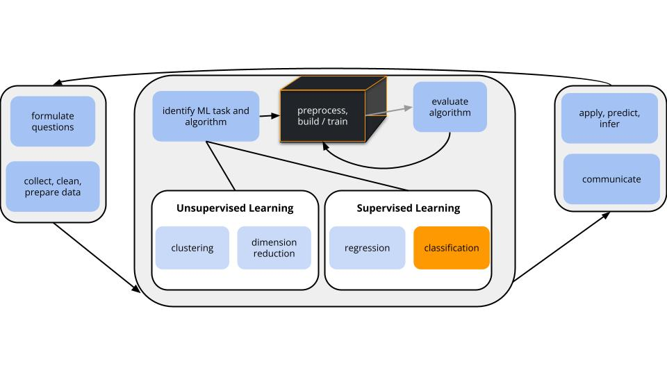

```{r include = FALSE}
knitr::opts_chunk$set(
  collapse = TRUE, 
  warning = FALSE,
  message = FALSE, 
  error = TRUE,
  fig.height = 2.75, 
  fig.width = 4.25,
  fig.env='figure',
  fig.pos = 'h',
  fig.align = 'center')
```


You can download the .qmd file for this activity [here](../activity_templates/L15-forests.qmd) and open in R-studio. The rendered version is posted in the [course website](https://mutasim221b.github.io/Mac-STAT-253-Sp-26/) (Activities tab). I often experiment with the class activities (and see it in live!) and make updates, but I always post the final version before class starts. To be sure you have the most up-to-date copy, please download it once you’ve settled in before class begins.


# Settling In {.unnumbered}

- Turn in your quiz revisions!
- Install two new packages: `ranger` and `randomForest`.


# Quiz 02 
- Wednesday, April 8, in class 
- Focus on **classification** (Units 4--5), including both concepts and code
- On paper (no computers!) 
- Closed notes (except for an instructor-provided R notesheet and notecard)

## Study Tips {-}

- Complete the provided review activities:
  - Group Assignment 2
  - [STAT 253 concept maps](https://docs.google.com/presentation/d/1GIfPNfwnt7SwOTprYSLupunlrajCW7pJKQ9Q9rhHwZk/edit?usp=sharing) (Slides 1, 6, and 7)
  - [tidymodels code comparison](https://docs.google.com/document/d/1jyANFeAycznojZPEhUCl1O0VNljvuAQ4ZQQGuBm_WQo/edit?usp=sharing)
- Create a study guide using course [Learning Goals](../logistics/learning-objectives.qmd).
- Review past checkpoints, in-class exercises, and homework problems.
    - Carefully review the feedback you got on those assignments.       Try implementing any suggestions. 
- Come to office hours with questions!


*DISCUSS at your table:* 

- What did you do to prepare for Quiz 1 that you found helpful? 
- Anything you want to try differently for Quiz 2?


# Context {.unnumbered .smaller} 

{width=90%}


## Where are we? {-}    

Within the broader machine learning landscape, we left off by discussing **supervised classification techniques**:

- **build a model** of *categorical variable* y by predictors x       
    - parametric model: logistic regression (& LASSO, as you saw on HW4)
    - nonparametric models: KNN & trees

- **evaluate the model**        
    We can use CV & in-sample techniques to estimate the accuracy of our classification models.
    - for binary y: sensitivity, specificity, ROC curves
    - for y with any number of categories: overall accuracy rates, category specific accuracy rates


\

## Today's goal {-}       

Add more nonparametric algorithms to our toolkit: **random forests** & **bagging**


\
\


# Small Group Discussion {-}

Discuss the following questions with your group.


## Anticipation {.unnumbered .smaller}

{height="600"}

What does the word "forest" mean to you?


\
\

## Candy!!! {.unnumbered .smaller}

[fivethirtyeight article](https://fivethirtyeight.com/videos/the-ultimate-halloween-candy-power-ranking/)

[the experiment](http://walthickey.com/2017/10/18/whats-the-best-halloween-candy/)

```{r}
#| eval: true
#| echo: true
#| code-fold: true
library(tidyverse)
library(tidymodels)
library(rpart)        # for building trees
library(rpart.plot)   # for plotting trees
library(randomForest) # for bagging & forests
library(infer)        # for resampling

library(fivethirtyeight)
data("candy_rankings")
```

```{r}
#| eval: true
head(candy_rankings)
```


\

Write R code to find out the following: 

```{r}
# What are the 6 most popular candies?


# The least popular?

```


\
\

## Build an unpruned tree {.unnumbered .smaller}

*For demonstration purposes only* let's:

- define a `popularity` variable that categorizes the candies as "low", "medium", or "high" popularity
    - NOTE: Creating a categorical outcome variable will turn this into a classification problem. This is not strictly necessary here --- trees can also be used for regression! You'll explore this in HW5.
- delete the original `winpercent` variable
- rename variables to make them easier to read in a tree
- make the candy name a row label, not a predictor

```{r}
#| eval: true
#| code-fold: true
candy <- candy_rankings %>% 
  mutate(popularity = cut(winpercent, breaks = c(0, 40, 60, 100), labels = c("low", "med", "high"))) %>% 
  select(-winpercent) %>% 
  rename("price" = pricepercent, "sugar" = sugarpercent, "nutty" = peanutyalmondy, "wafer" = crispedricewafer) %>% 
  column_to_rownames("competitorname")
head(candy)
dim(candy)
```


\

Our goal is to model candy `popularity` by all possible predictors in our data.

```{r eval=TRUE, fig.height = 8, fig.width = 8}
# STEP 1: tree specification
tree_spec <- decision_tree() %>%
  set_mode("classification") %>% 
  set_engine(engine = "rpart") %>% 
  set_args(cost_complexity = 0, min_n = 2, tree_depth = 30)

# STEP 2: Build the tree! No tuning (hence no workflows) necessary.
original_tree <- tree_spec %>% 
  fit(popularity ~ ., data = candy)

# Plot the tree
original_tree %>% 
  extract_fit_engine() %>% 
  plot(margin = 0) 
original_tree %>% 
  extract_fit_engine() %>% 
  text(cex = 0.7)
```


Ideally, our classification algorithm would have both low bias and low variance:

- low variance = the results wouldn't change much if we changed up the data set
- low bias = within any data set, the predictions of y tend to have low error / high accuracy


Unfortunately, like other **overfit** algorithms, unpruned trees don't enjoy both of these.
They have (**SELECT ONE**)...

- low bias, low variance
- low bias, high variance
- high bias, low variance
- high bias, high variance


\
\

## New Concept {.unnumbered .smaller}

**GOAL**

Maintain the low bias of an unpruned tree while decreasing variance.

\

**APPROACH**

Build a bunch of unpruned trees from different data.
This way, our final result isn't overfit to our sample data.

\

**THE RUB (CHALLENGE/DIFFICULTY)**

We only have 1 set of data...


\
\

## Take a REsample of candy {.unnumbered .smaller}

We only have 1 sample of data.
But we can *re*sample it (basically pretending we have a different sample).

Let's each take our *own* unique candy resample (aka **bootstrapping**):

- Take a sample of 85 candies from the original 85 candies, *with* replacement.
- Some data points will be sampled multiple times while others aren't sampled at all.
- On average, 2/3 of the original data points will show up in the resample and 1/3 will be left out.


Take your resample:
    
```{r}
# Set the seed to YOUR 7-digit phone number (skip the country and area codes)
set.seed(1234567)

# Take a REsample of candies from our sample
my_candy <- sample_n(candy, size = nrow(candy), replace = TRUE)

# Check it out
head(my_candy, 3)
dim(my_candy)
```


\

In the next exercise, we'll each build a tree of `popularity` using our own resample data.

First, check your intuition:

a. TRUE / FALSE: All of our trees will be the same.
b. TRUE / FALSE: Our trees will use the same *predictor* (but possibly a different cut-off) in the first split.
c. TRUE / FALSE: Our trees will use the same predictors in all splits.


\

:::{.callout-tip title="Fun Math Facts"}
With resampling (also known as bootstrapping), we have an original sample of $n$ rows. We drawn individual rows with replacement from this set until we have another set of size $n$.

The probability of choosing any one row (say the 1st row) on the first draw is $1/n$. The probability of **not** choosing that one row is $1-1/n$. That is just for the first draw. There are $n$ draws, all of which are independent, so the probability of never choosing this particular row on any of the draws is $(1-1/n)^n$. 

If we consider larger and larger datasets (large $n$ going to infinity), then 

$$\lim_{n \rightarrow \infty} (1-1/n)^n = 1/e \approx 0.368$$

Thus, the probability that any one row is NOT chosen is about 1/3 and the probability that any one row is chosen is 2/3. 
:::


\
\

## Build & share YOUR tree {.unnumbered .smaller}

Build and plot a tree using your unique sample (`my_candy`):

```{r}
#| fig-width: 8
#| fig-height: 8
# Build your tree
my_tree <- tree_spec %>% 
  fit(popularity ~ ., data = my_candy)

# Plot your tree
my_tree %>% 
  extract_fit_engine() %>% 
  plot(margin = 0) 
my_tree %>% 
  extract_fit_engine() %>% 
  text(cex = 0.7)
```


\

Use your tree to classify Baby Ruth, the 7th candy in the original data.

Do this "by hand" first, using the tree you created above and info about the Baby Ruth predictor values: 

```{r}
#| eval: true
candy[7,]
```


\

Then check your prediction using R code:

```{r}
my_tree %>% 
  predict(new_data = candy[7,])
```


\

Finally, share your results!

Record your prediction and paste a picture of your tree into [this document](https://docs.google.com/document/d/1S3l0dN1vPhy6N_OOom8Z91HPe4X9f-V-_EC0e9_L0do/edit?usp=sharing).


\
\

## Using our FOREST {.unnumbered .smaller}

We now have a group of multiple trees -- a **forest**!

These trees...

- differ from resample to resample
- don't use the same predictor in each split (not even in the first split)!
- produce different `popularity` predictions for Baby Ruth


a. Based on our *forest* of trees (not just your 1 tree), what's your prediction for Baby Ruth's popularity?


b. What do you think are the advantages of predicting candy popularity using a forest instead of a single tree?


c. Can you anticipate any *drawbacks* of using forests instead of trees?

    


\
\

# Notes: Bagging and Forests {-}

## BAGGING (Bootstrap AGGregatING) & Random Forests {.unnumbered .smaller}

::: {.incremental}

To classify a categorical response variable y using a set of p predictors x:

- Take B *re*samples from the original sample.
    - Sample WITH replacement
    - Sample size = original sample size n

- Use each resample to build an *unpruned* tree.    
    - For bagging: consider all p predictors in each split of each tree    
    - For *random* forests: at each split in each tree, randomly select and consider only a *subset* of the predictors (often roughly p/2 or $\sqrt{p}$)

- Use each of the B trees to classify y at a set of predictor values x.    

- Average the classifications using a *majority vote*: classify y as the most common classification among the B trees.    
:::

<br>


## Ensemble Methods {.unnumbered .smaller}    

Bagging and random forest algorithms are **ensemble methods**.

They combine the outputs of *multiple* machine learning algorithms.

As a result, they decrease variability from sample to sample, hence provide more stable predictions / classifications than might be obtained by any algorithm alone.


<br>


## Pros & Cons {.unnumbered .smaller} 

a. Order trees, random forests, & bagging from least to most computationally expensive.

b. What results will be easier to interpret: trees or forests?

c. Which of bagging or random forests will produce a collection of trees that tend to look very similar to each other, and similar to the original tree? Hence which of these algorithms is more dependent on the sample data, thus will *vary* more if we change up the data? [both questions have the same answer]


\
\

# Exercises {-}

For the rest of the class, work together on Exercises 1--7

--------------------

1. **Tuning parameters (challenge)**        

Our random forest of `popularity` by all 11 possible predictors will depend upon 3 tuning parameters:        
    
- `trees` = the number of trees in the forest
- `mtry` = number of predictors to randomly choose & consider at each split
- `min_n` = minimum number of data points in any leaf node of any tree
    
Check your intuition.
    
a. Does increasing the number of `trees` make the forest algorithm *more* or *less* variable from dataset to dataset?

> Less variable (less impacted by "unlucky treees)

b. We have 11 possible predictors, and sqrt(11) is roughly 3. Recall: Would considering just 3 randomly chosen predictors in each split (instead of all 11) make the forest algorithm *more* or *less* variable from dataset to dataset?

> less variable

c. Recall that using *unpruned* trees in our forest is important to maintaining low bias. Thus should `min_n` be small or big?
> small


\

2. **Build the forest**       
    Given that forests are relatively computationally expensive, we'll only build *one* forest using the following tuning parameters:
    
- `mtry = NULL`: this sets `mtry` to the default, which is sqrt(number of predictors)
- `trees = 500`
- `min_n = 2`
    
Fill in the below code to run this forest algorithm.
    
```{r eval = FALSE}
# There's randomness behind the splits!
set.seed(253)
    
# STEP 1: Model Specification
rf_spec <- rand_forest()  %>%
  set_mode("___") %>%
  ___(engine = "ranger") %>% 
  ___(
    mtry = NULL,
    trees = 500,
    min_n = 2,
    probability = FALSE,    # Report classifications, not probability calculations
    importance = "impurity" # Use Gini index to measure variable importance
  )
    
# STEP 2: Build the forest
# There are no preprocessing steps or tuning, hence no need for a workflow!
candy_forest <- ___ %>% 
  fit(___, ___)
```
    

```{r}
# There's randomness behind the splits!
set.seed(253)
    
# STEP 1: Model Specification
rf_spec <- rand_forest()  %>%
  set_mode("classification") %>%
  set_engine(engine = "ranger") %>% 
  set_args(
    mtry = NULL,
    trees = 500,
    min_n = 2,
    probability = FALSE, # give classifications, not probability calculations
    importance = "impurity" # use Gini index to measure variable importance
  )
    
# STEP 2: Build the forest
# There are no preprocessing steps or tuning, hence no need for a workflow!
candy_forest <- rf_spec %>% 
  fit(popularity ~ ., data = candy)
```


\

3. **Use the forest for prediction**        
    Use the forest to predict the `popularity` level for Baby Ruth. (Remember that its real `popularity` is "med".)
    
```{r}
candy_forest %>% 
  predict(new_data = candy[7,])
```


\

4. **Evaluating forests: concepts**    

But how *good* is our forest at classifying candy popularity?

To this end, we could evaluate 3 types of forest predictions.
    
a. Why don't **in-sample** predictions, i.e. asking how well our forest classifies our sample candies, give us an "honest" assessment of our forest's performance?
b. Instead, suppose we used **10-fold cross-validation (CV)** to estimate how well our forest classifies *new* candies. In this process, how many total *trees* would we need to construct?  
c. Alternatively, we can estimate how well our forest classifies *new* candies using the **out-of-bag (OOB) error rate**. Since we only use a *resample* of data points to build any given tree in the forest, the "out-of-bag" data points that do *not* appear in a tree's resample are natural test cases for that tree. The OOB error rate tracks the proportion or percent of these out-of-bag test cases that are misclassified by their tree. How many total trees would we need to construct to calculate the OOB error rate?
d. Moving forward, we'll use OOB and *not* CV to evaluate forest performance. Why?
    


\

5. **Evaluating forests: implementation**    

a. Report and interpret the estimated `OOB prediction error`.
```{r}
candy_forest
``` 

b. The **test** or **OOB confusion matrix** provides more detail. Use this to confirm the OOB prediction error from part a. HINT: Remember to calculate *error* (1 - accuracy), not *accuracy*.       

```{r}
# NOTE: t() transposes the confusion matrix so that 
# the columns and rows are in the usual order
candy_forest %>% 
  extract_fit_engine() %>% 
  pluck("confusion.matrix") %>% 
  t()
```

```{r}
# APPROACH 1: # of MISclassifications / total # of classifications
(6 + 1 + 15 + 6 + 2 + 4) / (8 + 29 + 14 + 6 + 1 + 15 + 6 + 2 + 4) 
## [1] 0.4

# APPROACH 2: overall MISclassification rate = 1 - overall accuracy rate
# overall accuracy rate
(8 + 29 + 14) / (8 + 29 + 14 + 6 + 1 + 15 + 6 + 2 + 4) 
## [1] 0.6
# overall misclassification rate
1 - 0.6
## [1] 0.4
```

c. Which level of candy popularity was least accurately classified by our forest?
    
d. Check out the **in-sample** confusion matrix. In general, are the in-sample predictions better or worse than the OOB predictions?
```{r eval=TRUE}
# The cbind() includes the original candy data
# alongside their predicted popularity levels
candy_forest %>% 
  predict(new_data = candy) %>% 
  cbind(candy) %>% 
  conf_mat(
    truth = popularity,
    estimate = .pred_class
  )
```

   
   
   


\

6. **Variable importance**  

Variable importance metrics, averaged over all trees, measure the strength of the 11 predictors in classifying candy `popularity`:
    
```{r}
# Print the metrics
candy_forest %>%
  extract_fit_engine() %>%
  pluck("variable.importance") %>% 
  sort(decreasing = TRUE)
    
# Plot the metrics
library(vip)
candy_forest %>% 
  vip(geom = "point", num_features = 11)
```
    
a. If you're a candy connoisseur, does this ranking make some contextual sense to you?    

b. The only 2 *quantitative* predictors, `sugar` and `price`, have the highest importance metrics. This *could* simply be due to their quantitative structure: trees tend to favor predictors with lots of unique values. *Explain*. HINT: A tree's binary splits are identified by considering *every* possible cut / split point in *every* possible predictor.

    
   


\

7. **Classification regions**    

Just like any classification model, forests divide our data points into classification regions.

Let's explore this idea using some *simulated* data that illustrate some important contrasts.^[citation: https://daviddalpiaz.github.io/r4sl/ensemble-methods.html#tree-versus-ensemble-boundaries]

Import and plot the data:
    
```{r eval=TRUE}
# Import data
simulated_data <- read.csv("https://mac-stat.github.io/data/circle_sim.csv") %>% 
  mutate(class = as.factor(class))
    
# Plot data
ggplot(simulated_data, aes(y = X2, x = X1, color = class)) + 
  geom_point() + 
  theme_minimal()
```
    
a. Below is a classification **tree** of `class` by `X1` and `X2`. What do you think its classification regions will look like?        

```{r eval=TRUE}
# Build the (default) tree
circle_tree <- decision_tree() %>%
  set_mode("classification") %>% 
  set_engine(engine = "rpart") %>% 
  fit(class ~ ., data = simulated_data)

circle_tree %>% 
  extract_fit_engine() %>% 
  rpart.plot()
```
    
b. Check your intuition. Were you right? 

```{r}
# THIS IS ONLY DEMO CODE.
# Plot the tree classification regions
examples <- data.frame(X1 = seq(-1, 1, len = 100), X2 = seq(-1, 1, len = 100)) %>% 
  expand.grid()

circle_tree %>% 
  predict(new_data = examples) %>% 
  cbind(examples) %>% 
  ggplot(aes(y = X2, x = X1, color = .pred_class)) + 
  geom_point() + 
  labs(title = "tree classification regions") + 
  theme_minimal()
```
    
c. If we built a **forest** model of `class` by `X1` and `X2`, what do you think the classification regions will look like?
    
d. Check your intuition. Were you right?  

```{r}
# THIS IS ONLY DEMO CODE.
# Build the forest
circle_forest <- rf_spec %>% 
  fit(class ~ ., data = simulated_data)

# Plot the tree classification regions
circle_forest %>% 
  predict(new_data = examples) %>% 
  cbind(examples) %>% 
  ggplot(aes(y = X2, x = X1, color = .pred_class)) + 
  geom_point() + 
  labs(title = "forest classification regions") + 
  theme_minimal()
```
    
e. Reflect on what you've observed here!
    


<br>


# Notes: OOB (Out-of-Bag) Error in Random Forests {-}

## What is OOB? {.unnumbered .smaller}

::: {.incremental}

🌳 **OOB (Out-of-Bag)** = data points **NOT used** to build a particular tree

:::

---

## Step 1: How a random forest builds trees {.unnumbered .smaller}

::: {.incremental}

For each tree:

- Take a **bootstrap sample** (sample *with replacement*)  
- From the original dataset (say 100 candies)

👉 Result:

- ~63 candies are used to build the tree  
- ~37 candies are left out  

👉 Those 37 candies = **OOB data** for that tree

🧠 **Key idea:**  
Each tree has its own **training data + leftover (OOB) test data**

:::

---

## Step 2: What happens to ONE observation? {.unnumbered .smaller}

::: {.incremental}

Take 1 candy 🍬

- It might be used in some trees  
- It will be left out in others  

👉 On average:

- It is OOB for about **1/3 of the trees**

So if we have:

👉 **500 trees**

- That candy is OOB for ~**150 trees**

:::

---

## Step 3: How OOB prediction is made {.unnumbered .smaller}

::: {.incremental}

For that one candy:

- Look at only the trees where it was **NOT used**
- Each of those trees predicts its class
- Take a **majority vote**

👉 This is the **OOB prediction** for that candy

:::

---

## Step 4: OOB error {.unnumbered .smaller}

::: {.incremental}

- Compare OOB prediction vs true label  
- Repeat for all candies  
- Compute overall **error rate**

:::

---

## Why not just 1 tree? {.unnumbered .smaller}

::: {.incremental}

❌ **One tree is NOT enough**

- Each candy would be OOB only once  
- Predictions would be **very unstable (high variance)**  

✅ **With 500 trees**

- Each candy gets predicted by ~**150 trees**  
- This gives:

    - more stable predictions  
    - more reliable error estimate  

:::

---

## Intuition (Analogy) {.unnumbered .smaller}

::: {.incremental}

Imagine:

- 500 teachers grading a student  
- Each teacher did NOT see that student’s homework  

👉 Average their opinions → fair evaluation  

Now compare:

- ❌ 1 teacher → unreliable  
- ✅ 150 teachers → much more reliable  

:::

---

## Key Takeaway {.unnumbered .smaller}

::: {.incremental}

OOB is like **built-in cross-validation** using many trees, not just one.

:::

---

## Final Explanation {.unnumbered .smaller}

::: {.incremental}

OOB means “out-of-bag,” referring to observations not used to build a particular tree. Since each tree is built using a bootstrap sample, about one-third of the data is left out and can be used as test data for that tree. Each observation is out-of-bag for many trees (around 150 if there are 500 trees), and its prediction is based on those trees. This is why we need all 500 trees—not just one—to obtain a stable and reliable OOB error estimate.

:::


**If you finish early**        

Do one of the following:  

- Check out the optional "Deeper learning" section below on another ensemble method: **boosting**.
- Check out group assignment 2 on Moodle. Next class, your group will pick what topic to explore.
- Work on homework.
    
 

<br><br>


# Deeper learning {-}

## Boosting {.unnumbered .smaller} 

*Extreme gradient boosting*, or **XGBoost**, is yet another ensemble algorithm for regression and classification.
We'll consider the big picture here.
If you want to dig deeper:

- Section 8.2.3 of the book provides a more detailed background
- Julia Silge's [blogpost on predicting home runs](https://juliasilge.com/blog/baseball-racing/) provides an example of implementing XGBoost using `tidymodels`.


The **big picture**:

- Like bagging and forests, boosting combines predictions from B different trees.

- BUT these trees aren't built from B different resamples. Boosting trees are grown *sequentially*, each tree *slowly learning* from the previous trees in the sequence to *improve* in areas where the previous trees didn't do well. Loosely speaking, data points with larger misclassification rates among previous trees are given more weight in building future trees.

- Unlike in bagging and forests, trees with better performance are given more weight in making future classifications. 


\
\


**Bagging vs boosting**

- Bagging typically helps decrease variance, but not bias. Thus it is useful in scenarios where other algorithms are unstable and overfit to the sample data.

- Boosting typically helps decrease bias, but not variance. Thus it is useful in scenarios where other algorithms are stable, but overly simple. 


<br><br>

# Notes: R code {-}

Suppose we want to build a forest or bagging algorithm of some categorical response variable `y` using predictors `x1` and `x2` in our `sample_data`.

--------------------------

```{r eval = FALSE}
# Load packages
library(tidymodels)
library(rpart)
library(rpart.plot)

# Resolves package conflicts by preferring tidymodels functions
tidymodels_prefer()
```


\
\


**Make sure that y is a factor variable**

```{r eval = FALSE}
sample_data <- sample_data %>% 
  mutate(y = as.factor(y))
```


\
\


**Build the forest / bagging model**

We'll typically use the following tuning parameters:

- `trees` = 500 (the more trees we use, the less variable the forest)
- `min_n` = 2 (the smaller we allow the leaf nodes to be, the less pruned, hence less biased our forest will be)
- `mtry`
    - for forests: `mtry = NULL` (the default) will use the "floor", or biggest integer below, sqrt(number of predictors)
    - for bagging: set `mtry` to the number of predictors

```{r eval = FALSE}
# STEP 1: Model Specification
rf_spec <- rand_forest()  %>%
  set_mode("classification") %>%
  set_engine(engine = "ranger") %>% 
  set_args(
    mtry = ___,
    trees = 500,
    min_n = 2,
    probability = FALSE, # give classifications, not probability calculations
    importance = "impurity" # use Gini index to measure variable importance
  )

# STEP 2: Build the forest or bagging model
# There are no preprocessing steps or tuning, hence no need for a workflow!
ensemble_model <- rf_spec %>% 
  fit(y ~ x1 + x2, data = sample_data)
```

\
\


**Use the model to make predictions / classifications**


```{r eval = FALSE}
# Put in a data.frame object with x1 and x2 values (at minimum)
ensemble_model %>% 
  predict(new_data = ___)  
```


\
\


**Examine variable importance**

```{r eval = FALSE}
# Print the metrics
ensemble_model %>%
  extract_fit_engine() %>%
  pluck("variable.importance") %>% 
  sort(decreasing = TRUE)

# Plot the metrics
# Plug in the number of top predictors you wish to plot
# (The upper limit varies by application!)
library(vip)
ensemble_model %>% 
  vip(geom = "point", num_features = ___)
```


\
\


**Evaluate the classifications**

```{r eval = FALSE}
# Out-of-bag (OOB) prediction error
ensemble_model

# OOB confusion matrix
ensemble_model %>% 
  extract_fit_engine() %>% 
  pluck("confusion.matrix") %>% 
  t()

# In-sample confusion matrix
ensemble_model %>% 
  predict(new_data = sample_data) %>% 
  cbind(sample_data) %>% 
  conf_mat(
    truth = y,
    estimate = .pred_class
  )
```


\
\


# Solutions  {.unnumbered .smaller}


## Small Group Discussion {.unnumbered .smaller}

1. Anticipation

<details>
<summary>Solution:</summary>
Answers will vary, but one definition = a collection of trees!
</details><br>


2. Candy!


<details>
<summary>Solution:</summary>
```{r eval=TRUE}
# What are the 6 most popular candies?
## OPTION 1
candy_rankings %>% 
  arrange(desc(winpercent)) %>% 
  head()

## OPTION 2
candy_rankings %>%
  slice_max(winpercent, n = 6)

# The least popular?
## OPTION 1
candy_rankings %>% 
  arrange(winpercent) %>% 
  head()

## OPTION 2
candy_rankings %>%
  slice_min(winpercent, n = 6)
```
</details><br>


3. Build an unpruned tree


<details>
<summary>Solution:</summary>
low bias, high variance
</details><br>


4. Take a REsample

<details>
<summary>Solution:</summary>
a. FALSE
b. FALSE
c. FALSE
</details><br>


5. Build & share YOUR tree

<details>
<summary>Solution:</summary>
My tree looks like this (yours will be a little different):

```{r}
#| eval: true
#| fig-width: 8
#| fig-height: 8
#| code-fold: true
# Take a REsample of candies from our sample
set.seed(1234567)
my_candy <- sample_n(candy, size = nrow(candy), replace = TRUE)

# Build your tree
my_tree <- tree_spec %>% 
  fit(popularity ~ ., data = my_candy)

# Plot your tree
my_tree %>% 
  extract_fit_engine() %>% 
  plot(margin = 0) 
my_tree %>% 
  extract_fit_engine() %>% 
  text(cex = 0.7)
```


Based on this tree, we predict Baby Ruth are medium popularity:  

```{r}
#| eval: true
my_tree %>% 
  predict(new_data = candy[7,])
```

</details><br>


6. Using our FORESTS

<details>
<summary>Solution:</summary>
a. take the majority vote, i.e. most common category
b. by averaging across multiple trees, classifications will be more stable / less variable from dataset to dataset (lower variance)
c. computational intensity (lack of efficiency), harder to visualize / interpret
</details><br>


<br>

## Notes {.unnumbered .smaller}

1. pros & cons

<details>
<summary>Solution:</summary>
a. trees, forests, bagging
b. trees (we can't draw a forest)
c. bagging (forests tend to have lower variability)
</details><br>


<br>

## Exercises {.unnumbered .smaller}

1. **Tuning parameters (challenge)**  

<details>
<summary>Solution:</summary>
a. less variable (less impacted by "unlucky" trees)
b. less variable
c. small
</details><br>


2. **Build the forest**   


<details>
<summary>Solution:</summary>
```{r eval=TRUE}
# There's randomness behind the splits!
set.seed(253)
    
# STEP 1: Model Specification
rf_spec <- rand_forest()  %>%
  set_mode("classification") %>%
  set_engine(engine = "ranger") %>% 
  set_args(
    mtry = NULL,
    trees = 500,
    min_n = 2,
    probability = FALSE, # give classifications, not probability calculations
    importance = "impurity" # use Gini index to measure variable importance
  )
    
# STEP 2: Build the forest
# There are no preprocessing steps or tuning, hence no need for a workflow!
candy_forest <- rf_spec %>% 
  fit(popularity ~ ., data = candy)
```
</details><br>


3. **Use the forest for prediction**

<details>
<summary>Solution:</summary>
```{r}
#| eval: true
candy_forest %>% 
  predict(new_data = candy[7,])
```
</details><br>


4. **Evaluating forests: concepts**   

<details>
<summary>Solution:</summary>
a. they use the same data we used to build the forest
b. 10 forests `*` 500 trees each = 5000 trees
c. 1 forest `*` 500 trees = 500 trees
d. it's much more computationally efficient
</details><br>


5. **Evaluating forests: implementation** 

 
<details>
<summary>Solution:</summary>

a. We expect our forest to *mis*classify roughly 40% of *new* candies.
b. .        
```{r eval=TRUE}
# APPROACH 1: # of MISclassifications / total # of classifications
(6 + 1 + 15 + 6 + 2 + 4) / (8 + 29 + 14 + 6 + 1 + 15 + 6 + 2 + 4) 

# APPROACH 2: overall MISclassification rate = 1 - overall accuracy rate
# overall accuracy rate
(8 + 29 + 14) / (8 + 29 + 14 + 6 + 1 + 15 + 6 + 2 + 4) 
# overall misclassification rate
1 - 0.6
```

c. low (more were classified as "med" than as "low")
d. much better!

</details><br>


6. **Variable importance**  

 
<details>
<summary>Solution:</summary>
  
a. will vary
b. predictors with lots of unique values have far more possible split points to choose from
</details><br>


7. **Classification regions**  

<details>
<summary>Solution:</summary>

b. ...
```{r eval = TRUE}
# THIS IS ONLY DEMO CODE.
# Plot the tree classification regions
examples <- data.frame(X1 = seq(-1, 1, len = 100), X2 = seq(-1, 1, len = 100)) %>% 
  expand.grid()

circle_tree %>% 
  predict(new_data = examples) %>% 
  cbind(examples) %>% 
  ggplot(aes(y = X2, x = X1, color = .pred_class)) + 
  geom_point() + 
  labs(title = "tree classification regions") + 
  theme_minimal()
```

d. ...
```{r eval=TRUE}
# THIS IS ONLY DEMO CODE.
# Build the forest
circle_forest <- rf_spec %>% 
  fit(class ~ ., data = simulated_data)

# Plot the tree classification regions
circle_forest %>% 
  predict(new_data = examples) %>% 
  cbind(examples) %>% 
  ggplot(aes(y = X2, x = X1, color = .pred_class)) + 
  geom_point() + 
  labs(title = "forest classification regions") + 
  theme_minimal()
```

e. Forest classification regions are less rigid / boxy than tree classification regions.
      

</details><br>
