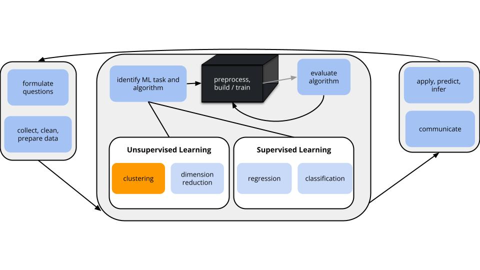
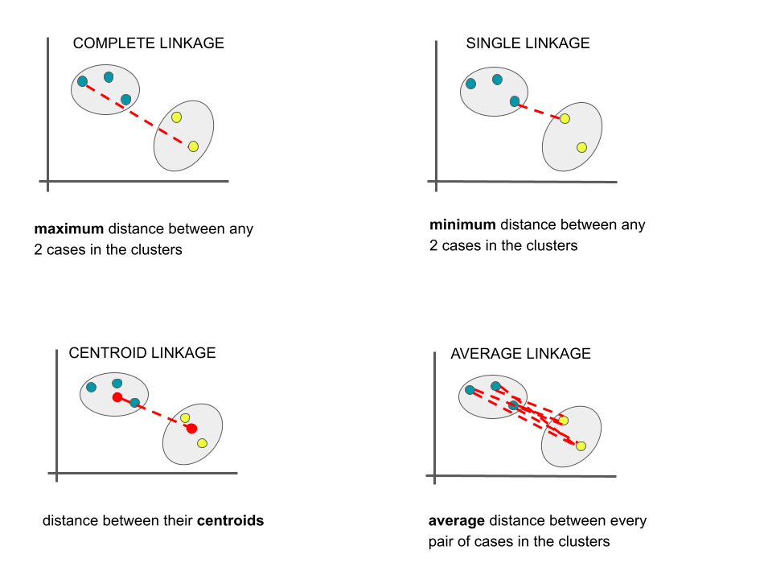
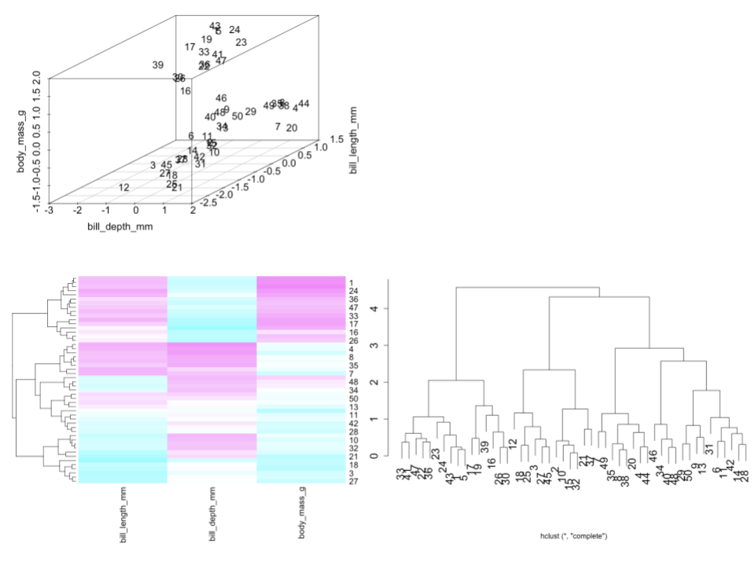

```{r include = FALSE}
knitr::opts_chunk$set(
  collapse = TRUE, 
  warning = FALSE,
  message = FALSE,
  fig.height = 2.75, 
  fig.width = 4.25,
  fig.env='figure',
  fig.pos = 'h',
  fig.align = 'center')
```


You can download the .qmd file for this activity [here](../activity_templates/L17-hclust.qmd) and open in R-studio. The rendered version is posted in the [course website](https://mutasim221b.github.io/Mac-STAT-253-Sp-26/) (Activities tab). I often experiment with the class activities (and see it in live!) and make updates, but I always post the final version before class starts. To be sure you have the most up-to-date copy, please download it once you’ve settled in before class begins.


# Learning Goals {.unnumbered .smaller}

- Clearly describe / implement by hand the hierarchical clustering algorithm
- Interpret cuts of the dendrogram for single and complete linkage
- Implement strategies for interpreting / contextualizing the clusters

\
\


# Notes: Unsupervised Learning {-}

## Context {.unnumbered .smaller}

{width=90%}

**GOALS**   

Suppose we have a set of **feature** variables $(x_1,x_2,...,x_k)$ but NO outcome variable $y$. 

Instead of our goal being to predict/classify/explain $y$, we might simply want to...    

1. Examine the **structure** of our data.
2. Utilize this examination as a **jumping off point** for further analysis.


\

## Unsupervised Methods {.unnumbered .smaller}

Cluster Analysis (Unit 6): 

- Focus: Structure among the *rows*, i.e. individual cases or data points.
- Goal: Identify and examine *clusters* or distinct groups of cases with respect to their features x.    
- Methods: hierarchical clustering & K-means clustering    

Dimension Reduction (Unit 7): 

- Focus: Structure among the *columns*, i.e. features x.
- Goal: *Combine* groups of correlated features x into a smaller set of *uncorrelated* features which preserve the majority of information in the data. (We'll discuss the motivation later!)
- Methods: Principal components


<br>
<br>

# Notes: Hierarchical Cluster Analysis {-}

Let's recap the main ideas from the videos you watched before class today.


\

## Goal {.unnumbered .smaller}

     
Create a hierarchy of clusters where clusters consist of similar data points.


\

## Algorithm {.unnumbered .smaller}

Suppose we have a set of p feature variables ($x_1, x_2,..., x_p$) on each of n data points. Each data point starts as a leaf.

- Compute the Euclidean distance between all pairs of data points with respect to x.
- Fuse the 2 closest data points into a single cluster or branch. 
- Continue to fuse the 2 closest clusters until all cases are in 1 cluster.

NOTE: This is referred to as an "agglomerative" algorithm.


\

## Dendrograms {.unnumbered .smaller}   

The hierarchical clustering algorithm produces a *dendrogram* (of or relating to trees).  

To use a dendrogram:    

:::{.incremental}
- Start with the leaves at the bottom (unlike classification trees!). Each leaf represents a single case / row in our dataset.    
- Moving up the tree, fuse similar leaves into branches, fuse similar branches into bigger branches, fuse all branches into one big trunk (all cases).    
- The more similar two cases, the sooner their branches will fuse. The height of the first fusion between two cases’ branches measures the "distance" between them.    
- The horizontal distance between 2 leaves does not reflect distance!
:::


\

## Measuring Distance {.unnumbered .smaller}  

There are several *linkages* we can use to measure distance between 2 clusters / branches.  Unless specified otherwise, we'll use the **complete** linkage method.    





<br>
<br>


## Example 1: Standardizing the features {.unnumbered .smaller}  

Let's start by using hierarchical clustering to identify similar groups (and possible species!) of penguins with respect to their bill lengths (mm), bill depths (mm), and body masses (g).

This algorithm relies on calculating the distances between each pair of penguins.

Why is it important to first *standardize* our 3 features to the same scale (centered around a mean of 0 with standard deviation 1)?

> The features are on different scales. It's important to standardize so that one feature doesn't have more influence over the distance measure, simply due to its scale.

```{r}
library(tidyverse)
library(palmerpenguins)
library(ggplot2)
data("penguins")
penguins %>% 
  select(bill_length_mm, bill_depth_mm, body_mass_g) %>% 
  head()
```


\

## Example 2: Interpreting a dendrogram {.unnumbered .smaller}  

Check out the standardized data, heat map, and dendrogram for a sample of just 50 penguins.



a. Is penguin 30 more similar to penguin 33 or 12?

> 33 -- 30 and 33 cluster together sooner than 30 and 12

b. Identify and interpret the distance, calculated using the *complete* linkage, between penguins 30 and 33.

> This clustering was done using the complete linkage method. Thus _at most_, the standardized difference in the bill length, bill depth, and body mass of penguins 30 and 33 is 2.

c. Consider the far left penguin cluster on the dendrogram, starting with penguin 33 and ending with penguin 30. Use the heat map to describe what these penguins have in common.

> That group generally has large bill length and body mass but small bill depth.


\

## Example 3: By Hand - Class Notes {.unnumbered .smaller}  

To really get the details, we'll perform hierarchical clustering by hand for a small example.

- [paper handout](https://docs.google.com/document/d/1abptMI_GsEM-LbGAFBRHRFsW8yJC9iajzjAqjxaCgpg/edit?usp=sharing). 

Code for importing the data is here:

```{r}
#| fig-width: 4
#| fig-height: 4
#| eval: true
# Record the data
penguins_small <- data.frame(
  width = c(-1.3, -0.8, 0.2, 0.8, 1.0), 
  length = c(0.6, 1.4, -1.0, -0.2, -0.7))

# Plot the data
ggplot(penguins_small, aes(x = width, y = length)) + 
  geom_point() + 
  geom_text(aes(label = c(1:5)), vjust = 1.5) + 
  theme_minimal()

# Calculate the distance between each pair of penguins
round(dist(penguins_small), 2)


# Type out the R code from Part b below


```


\

## Example 4: Explore Clusters {.unnumbered .smaller}  

Now, let's go back to a sample of 50 penguins.

Run the 2 chunks below to build a shiny app that we'll use to build some intuition for hierarchical clustering.

a. Put the slider at 9 clusters. These 9 clusters are represented in the dendrogram and scatterplot of the data. Do you think that 9 clusters is too many, too few, or just right?

> too many. they're very specific

b. Now set the slider to 5. Simply take note of how the clusters appear in the data.

> ....

c. Now sloooooowly set the slider to 4, then 3, then 2. Each time, notice what happens to the clusters in the data plot. Describe what you observe.

> the clusters continue to merge as we go up the dendrogram. (eg: the 5-cluster solution is nested in the 4-cluster solution)

d. What are your thoughts about the 2-cluster solution? What happened?!

> yikes! this solution doesn't capture the more natural looking clusters in the data. this algorithm is greedy -- it makes the best decisions at each step, but the results aren't necessarily globally optimal. 

> The 2-cluster solution does not seem to reflect the most natural grouping in the data. As we move down to fewer clusters, hierarchical clustering keeps merging existing groups rather than re-optimizing the whole clustering. Because the algorithm is greedy, early merge decisions cannot be undone, so the 2-cluster result can look unnatural.

> Hierarchical clustering is called greedy because at each step it makes the best immediate merge based on the distance rule: merge the two closest clusters now! But it does not ask: “Will this still look best later when I want only 2 clusters?” So it makes local decisions step by step, and those early decisions are locked in.


```{r}
#| code-fold: true
# Load the data
library(tidyverse)
set.seed(253)
more_penguins <- penguins %>% 
  sample_n(50) %>% 
  select(bill_length_mm, bill_depth_mm) %>% 
  na.omit()

# Run hierarchical clustering
penguin_cluster <- hclust(dist(scale(more_penguins)), method = "complete")

# Record cluster assignments
clusters <- more_penguins %>% 
  mutate(k = rep(1, nrow(more_penguins)), cluster = rep(1, nrow(more_penguins)))
for(i in 2:12){
 clusters <- more_penguins %>% 
  mutate(k = rep(i, nrow(more_penguins)), 
         cluster = cutree(penguin_cluster, k = i)) %>% 
  bind_rows(clusters)
}

```

```{r}
#| eval: false
#| code-fold: true
library(shiny)
library(factoextra)
library(RColorBrewer)
# Build the shiny server
server_hc <- function(input, output) {
  dend_plot <- reactive({ 
    cols = brewer.pal(n= input$k_pick, "Set1")
    fviz_dend(penguin_cluster, k = input$k_pick, k_colors = cols)
})
  
  output$model_plot <- renderPlot({
    cols = brewer.pal(n= input$k_pick, "Set1")
    dend <- attributes(dend_plot())$dendrogram
    tree_order <- order.dendrogram(dend)
    clusters_k <- clusters %>% 
      filter(k == input$k_pick) 
    clusters_k <- clusters_k %>%
      mutate(cluster = factor(cluster, levels = unique(clusters_k$cluster[tree_order])))
    names(cols) = unique(clusters_k$cluster[tree_order])
    
    clusters_k %>% 
      ggplot(aes(x = bill_length_mm, y = bill_depth_mm, color = factor(cluster))) + 
        geom_point(size = 3) +
      scale_color_manual(values = cols) + 
        theme_minimal() + 
        theme(legend.position = "none")
  })
  output$dendrogram <- renderPlot({
   dend_plot()
  })
}

# Build the shiny user interface
ui_hc <- fluidPage(
  sidebarLayout(
    sidebarPanel(
      h4("Pick the number of clusters:"), 
      sliderInput("k_pick", "cluster number", min = 1, max = 9, value = 9, step = 1, round = TRUE)
    ),
    mainPanel(
      plotOutput("dendrogram"),
      plotOutput("model_plot")
    )
  )
)


# Run the shiny app!
shinyApp(ui = ui_hc, server = server_hc)
```


\

## Example 5: Details {.unnumbered .smaller}  

a. Is hierarchical clustering **greedy**?

> Yes!

b. We learned in the video that, though they both produce tree-like output, the hierarchical clustering and classification tree algorithms are *not the same thing*! Similarly, though they both calculate distances between each pair of data points, the hierarchical clustering and KNN algorithms are *not the same thing*! Explain.

> Clustering is a process of combining similar neighbors based on a full set of variables/features while KNN and Classifications look at points that are similar in terms of predictors with the goal of getting useful predictions of an outcome. 


Note: When all features x are quantitative or logical (TRUE/FALSE), we measure the similarity of 2 data points with respect to the Euclidean distance between their *standardized* x values. But if at least 1 feature x is a factor / categorical variable, we measure the similarity of 2 data points with respect to their Gower distance. The idea is similar to what we did in KNN (converting categorical x variables to dummies, and then standardizing), but the details are different. 

If you're interested: 

```{r eval = FALSE}
library(cluster)
?daisy
```


\
\

# Small Group Discussion {-}


## Notes: R code {.unnumbered .smaller}

The `tidymodels` package is built for *models* of some outcome variable y.
We can't use it for clustering.

Instead, we'll use a variety of new packages that use specialized, but short, syntax.

---------------------

Suppose we have a set of `sample_data` with multiple feature columns x, and (possibly) a column named `id` which labels each data point.

```{r eval = FALSE}
# Install packages
library(tidyverse)
library(cluster)      # to build the hierarchical clustering algorithm
library(factoextra)   # to draw the dendrograms
```


\


**PROCESS THE DATA**

If there's a column that's an identifying variable or label, not a feature of the data points, convert it to a row name.

```{r eval = FALSE}
sample_data <- sample_data %>% 
  column_to_rownames("id")
```


\


**RUN THE CLUSTERING ALGORITHM**


```{r eval = FALSE}
# Scenario 1: ALL features x are quantitative OR logical (TRUE/FALSE)
# Use either a "complete", "single", "average", or "centroid" linkage_method
hier_model <- hclust(dist(scale(sample_data)), method = ___)

# Scenario 2: AT LEAST 1 feature x is a FACTOR (categorical)
# Use either a "complete", "single", "average", or "centroid" linkage
hier_model <- hclust(daisy(sample_data, metric = "gower"), method = ___)
```


\


**VISUALIZING THE CLUSTERING: HEAT MAPS AND DENDRODGRAMS**

NOTE: Heat maps can be goofy if at least 1 x feature is categorical

```{r eval = FALSE}
# Heat maps: ordered by the id variable (not clustering)
heatmap(scale(data.matrix(sample_data)), Colv = NA, Rowv = NA)

# Heat maps: ordered by dendrogram / clustering
heatmap(scale(data.matrix(sample_data)), Colv = NA)

# Dendrogram (change font size w/ cex)
fviz_dend(hier_model, cex = 1)
fviz_dend(hier_model, horiz = TRUE, cex = 1)  # Plot the dendrogram horizontally to read longer labels
```


\


**DEFINING & PLOTTING CLUSTER ASSIGNMENTS**

```{r eval = FALSE}
# Assign each sample case to a cluster
# You specify the number of clusters, k
# We typically want to store this in a new dataset so that the cluster assignments aren't 
# accidentally used as features in a later analysis!
cluster_data <- sample_data %>% 
  mutate(hier_cluster_k = as.factor(cutree(hier_model, k = ___)))
         
# Visualize the clusters on the dendrogram (change font size w/ cex)
fviz_dend(hier_model, k = ___, cex = 1)
fviz_dend(hier_model, k = ___, horiz = TRUE, cex = 1)  # Plot the dendrogram horizontally to read longer labels
```


\
\


## Exercises {-}

For the rest of class, work together on HW6 Exercises 1--3.
We'll cover material in the next class to complete the rest of the exercises. 


\
\

# Solutions {-}


EXAMPLE 3: By Hand 


<details>
<summary>Solution:</summary>

**COMPLETE LINKAGE**


```{r eval=TRUE}
library(tree)
penguin_cluster <- hclust(dist(penguins_small), method = "complete")
plot(penguin_cluster)
```


**SINGLE LINKAGE**


```{r eval=TRUE}
penguin_cluster <- hclust(dist(penguins_small), method = "single")
plot(penguin_cluster)
```

__Step 1__

The closest pair are 4 and 5 with a distance of 0.54

              1       2       3            4       5
------- ------- ------- ------- ------------ -------
   1          0
   2       0.94       0
   3       2.19    2.60       0
   4       2.25    2.26    1.00       0
   5       2.64    2.77    0.85    __0.54__       0
   


__Step 2__  

The distance matrix below gives the current distance between clusters 1, 2, 3, and (4 & 5) using single linkage (the distance between 2 clusters is the maximum distance btwn any pair of penguins in the 2 clusters). By this, penguin 3 is closest to the cluster of penguins 4 & 5, with a distance of 0.85:

              1       2       3   4 & 5
------- ------- ------- ------- -------
   1          0
   2       0.94       0
   3       2.19    2.60       0
 4 & 5     2.25    2.26    0.85       0


__Step 3__  

The distance matrix below gives the current distance between clusters 1, 2, and (3, 4, 5) using single linkage. By this, clusters 1 and 2 are the closest, with a distance of 0.94:

              1       2    3,4,5 
------- ------- ------- --------
   1          0
   2       0.94       0
 3,4,5     2.19    2.26       0


__Step 4__  

The distance matrix below gives the current distance between our 2 clusters, (1 & 2) and (3 & 4 & 5) using single linkage. The distance between them is 2.19 (hence the height of the final merge in our dendrogram):

         1 & 2   3,4,5
------- ------- -------
 1 & 2        0
 3,4,5     2.19       0


</details>


<br>