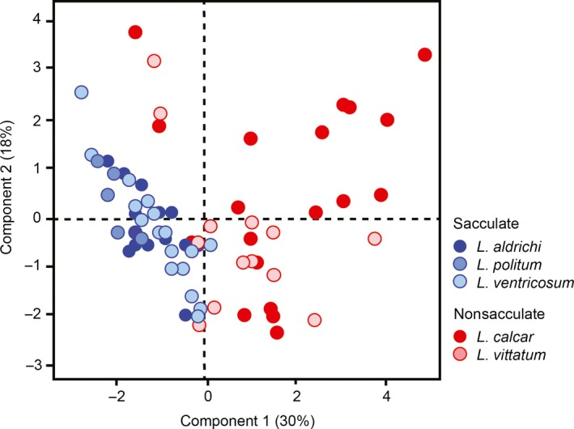

```{r include = FALSE}
knitr::opts_chunk$set(
  collapse = TRUE, 
  warning = FALSE,
  message = FALSE,
  fig.height = 2.75, 
  fig.width = 4.25,
  fig.env='figure',
  fig.pos = 'h',
  fig.align = 'center')
```


You can download the .qmd file for this activity [here](../activity_templates/L20-pcr.qmd) and open in R-studio. The rendered version is posted in the [course website](https://mutasim221b.github.io/Mac-STAT-253-Sp-26/) (Activities tab). I often experiment with the class activities (and see it in live!) and make updates, but I always post the final version before class starts. To be sure you have the most up-to-date copy, please download it once you’ve settled in before class begins.


## Announcements {.unnumbered}

Quiz 3 is coming up soon!

- Date: See Syllabus or Scheule

- Format: same as Quizzes 1 and 2

- Content: cumulative, but at least half will focus on unsupervised learning (concepts + code)

- The "cumulative" portion will focus on enduring, big picture concepts (eg bias-variance tradeoff, in-sample vs out-of-sample model evaluation) + high-level understanding of the algorithms we covered this semester (eg what type of ML task can they perform, pros & cons)

- Study Tips: 
  - Create a study guide using the "Learning Goals" page on the course website
  - Fill out the [STAT 253 Concepts Maps](https://docs.google.com/presentation/d/1GIfPNfwnt7SwOTprYSLupunlrajCW7pJKQ9Q9rhHwZk/edit?usp=sharing) (slides 9--11)
  - Work on Group Assignment 3
  - Review old CPs, HWs, and in-class exercises
  - Come to office hours with questions!


# Learning Goals {-}

- Explain the goal of dimension reduction and how this can be useful in a supervised learning setting
- Clearly describe / implement the principal component regression algorithm
- Describe the tradeoff of choice of principal components ($k$) in terms of the bias-variance tradeoff
- Implement strategies for choosing $k$
- Discuss the pros and cons of principal component regression relative to variable selection and LASSO


\
\
\

# Team Discussion {-}

Let's review some ideas from last class!


## Example 1 {-}

What is the goal of Principal Component Analysis? 

> Combine the original, potentially correlated, features into a smaller number of uncorrelated columns.


## Example 2 {-}

Consider the following PCA results from a paper written by Macalester faculty (Sarah Boyer, Biology; Dennis Cao, Chemistry) and student collaborators: 

{width=80%}

a. What is this type of plot called? 

> score plot

b. If the authors want to retain at least 50% of the variance in the original features, how many/which PCs should they keep?

> more than two, although we can’t tell the exact number from this figure. all we can see is that the first two PCs collectively explain 48% of the variance. adding one or two more should do the trick, but we’d need to check our scree plot to be sure.


c. When describing this figure in [their paper](https://pmc.ncbi.nlm.nih.gov/articles/PMC6131725/), the authors say: "Principal components analysis (PCA) on the free amino acid profiles of the harvestmen specimens yielded four PCs with eigenvalues exceeding 1, which collectively explain 70.6% of the total variation in amino acid composition. PC1 explains 30.2% of the variation and is characterized by positive loading of alanine, valine, phenylalanine, glutamic acid, and tyrosine, and negative loading of isoleucine and threonine. PC2 accounts for a further 17.7% of the variation and is characterized by positive loading of ..."  
    - What is a *loading*? 
    - What is the connection between loadings and *scores*? 
    - What can we learn from loadings about the original features? 
    
> loadings are coefficients/weights. they tell us how much each of the original variables contributes to the new features (PCs)

> the scores are constructed by multiplying the original feature values by their corresponding loadings

> from loadings, we can learn which features play the biggest role / contribute most substantially to each PC. we can also learn which of the original features are positively (or negatively) correlated with one another.


\
\
\

# Notes: PC Regression {-}

## Context {.unnumbered .smaller}

We've been distinguishing 2 broad areas in machine learning:

- supervised learning: when we want to predict / classify some outcome y using predictors x
- unsupervised learning: when we don't have any outcome variable y, only features x       
    - clustering: examine structure among the rows with respect to x
    - dimension reduction: examine & combine structure among the columns x
    


BUT sometimes we can combine these ideas!


\

## Combining Forces {.unnumbered .smaller}

**Dimension Reduction + Clustering**

1. Use dimension reduction to visualize / summarize lots of features and notice interesting groups.       
    Example: many physical characteristics of penguins, many characteristics of songs, etc
    
2. Use clustering to identify interesting groups.       
    Example: types (species) of penguins, types (genres) of songs, etc
    
    
**Clustering + Classification**

1. Use clustering to identify interesting groups.       
    Example: types (species) of penguins, types (genres) of songs, etc
    
2. These groups might then become our $y$ outcome variable in future analysis.        
    Example: classify new penguins as one of the "species" we identified, classify new songs as one of the "genres" we identified

EXAMPLE: [K-means clustering + Classification of news articles](https://github.com/AustinKrause/nyt-article-summarizer)


\

## Dimension Reduction + Regression: Dealing with lots of predictors {.unnumbered .smaller}

Suppose we have an outcome variable $y$ (quantitative OR categorical) and lots of potential predictors $x_1, x_2, ..., x_p$.
Perhaps we even have more predictors than data points ($p > n$)!


This idea of measuring lots of things on a sample is common in genetics, image processing, video processing, or really any scenario where we can grab data on a bunch of different features at once.
For simplicity, computational efficiency, avoiding overfitting, etc, it might benefit us to simplify our set of predictors.


There are a few approaches:  

- **variable selection (eg: using backward stepwise)**    
  Simply kick out some of the predictors. 
    
  NOTE: This *does not* work when $p > n$.    
    
    
- **regularization (eg: using LASSO)**    
  Shrink the coefficients toward / to 0.
  
  NOTE: This *sorta* works when $p > n$.    
    
    
- **feature extraction (eg: using PCA)**    
  Identify & utilize only the most *salient* features of the original predictors.
  Specifically, combine the original, possibly correlated predictors into a smaller set of uncorrelated predictors which retain most of the original information.
  
  NOTE: This *does* work when $p > n$.        


<br>


## Principal Component Regression (PCR) {.unnumbered .smaller}

- **Step 1**    
     Ignore $y$ for now.
     Use PCA to combine the $p$ original, correlated predictors $x$ into a set of $p$ uncorrelated PCs.

- **Step 2**        
    Keep only the first $k$ PCs which retain a "sufficient" amount of information from the original predictors.    

- **Step 3**    
    Model $y$ by these first $k$ PCs.  
    


<br>


## PCR vs Partial Least Squares {.unnumbered .smaller}

When combining the original predictors $x$ into a smaller set of PCs, PCA *ignores* $y$. Thus PCA might not produce the strongest possible predictors of $y$.

**Partial least squares** provides an alternative.

Like PCA, it combines the original predictors into a smaller set of uncorrelated features, but considers which predictors are most associated with $y$ in the process.

Chapter 6.3.2 in ISLR provides an optional overview.


\
\
\
\


## Example 3 {.unnumbered .smaller}

For each scenario below, indicate which would (typically) be preferable in modeling y by a large set of predictors x: (1) PCR; or (2) variable selection or regularization.

a. We have more potential predictors than data points ($p > n$).

> 1. (typically) can't do variable selection, regularization when $p > n$.

b. It's important to understand the specific relationships between y and x.

> 2. The PCs lose the original meaning of the predictors


c. The x are NOT very correlated.

> 2. PCR wouldn't simplify things much (need a lot of PCs to retain info). 


\
\
\


# HW7 {-} 

Exercises 3 focuses on PC Regression. 
In Exercise 4, you will compare your PC Regression model to LASSO.
Use the R Code Notes below to help with this!

Remember to `set.seed(253)` on any exercises that involve randomness.


# Group Assignment 3 {.unnumbered .smaller} 

```{r}
assign_groups <- function(students, n_groups = 2, seed = NULL) {
  if (!is.null(seed)) set.seed(seed)
  
  students <- sample(students)  # shuffle names
  
  groups <- split(
    students,
    rep(1:n_groups, length.out = length(students))
  )
  
  names(groups) <- paste("Group", seq_len(n_groups))
  return(groups)
}

# Example:
students <- c("Baituan", "Beckett", "Carmen", "Catriona", "Henry", "Su", "Sylvie", "Tara")

assign_groups(students, n_groups = 2, seed = 253)
```


# Exercise {.unnumbered .smaller} 

Before you leave class today: 

1. Participate in Course Survey
2. Get data on your local computers 
3. Start exploring the data: 
     - Familiarize yourself with the variables 
     - Create initial visualizations 
     - Determine if any data cleaning is needed (remove, modify, or create variables; remove or fill in missing values; remove observations) 
 4. Make a plan: 
     - How to decide which features to use, how many and which algorithms to try, how to evaluate each algorithm 
     - Set up communication avenues for out-of-class discussions (slack channel? in-person meetings? etc.) 
     - Divide / delegate leadership on tasks 


\
\
\


# Notes: R Code {-}

Suppose we have a set of `sample_data` with multiple predictors x, a *quantitative* outcome y, and (possibly) a column named `data_id` which labels each data point.
We could adjust this code if y were *categorical*.

---------------------


**RUN THE PCR algorithm**

```{r eval = FALSE}
# load packages
library(tidymodels)
library(tidyverse)

# STEP 1: specify a linear regression model
lm_spec <- linear_reg() %>% 
  set_mode("regression") %>% 
  set_engine("lm")

# STEP 2: variable recipe
# Add a pre-processing step that does PCA on the predictors
# num_comp is the number of PCs to keep (we need to tune it!)
# remove the update_role line if you don't have an ID variable you want to ignore in your model/PCA
pcr_recipe <- recipe(y ~ ., data = sample_data) %>% 
  update_role(data_id, new_role = "id") %>% 
  step_dummy(all_nominal_predictors()) %>% 
  step_normalize(all_predictors()) %>%
  step_pca(all_predictors(), num_comp = tune()) 

# STEP 3: workflow
pcr_workflow <- workflow() %>% 
  add_recipe(pcr_recipe) %>% 
  add_model(lm_spec)
  
# STEP 4: Estimate multiple PCR models trying out different numbers of PCs to keep
# For the range, the biggest number you can try is the number of predictors you started with
# Put the same number in levels
set.seed(___)
pcr_models <- pcr_workflow %>% 
  tune_grid(
    grid = grid_regular(num_comp(range = c(1, ___)), levels = ___),
    resamples = vfold_cv(sample_data, v = 10),
    metrics = metric_set(mae)
  )
```


\

**FOLLOW-UP**

Processing and applying the results is the same as for our other `tidymodels` algorithms!

Review previous notes to remind yourself how functions like `autoplot`, `select_by_one_std_err`, and `collect_metrics` work.


